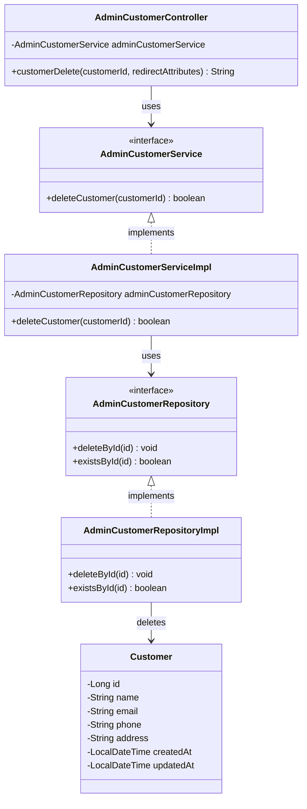

# クラス図_顧客削除

## クラス図

## クラス図の解説

### クラス間の関係

1. **AdminCustomerController**
   - 管理者顧客管理に関するリクエストを処理するコントローラー
   - `AdminCustomerService`を依存性注入で使用
   - `customerDelete`メソッドで顧客削除処理を行う

2. **AdminCustomerService**
   - 管理者向け顧客管理サービスのインターフェース
   - 顧客削除機能を定義

3. **AdminCustomerServiceImpl**
   - サービスインターフェースの実装クラス
   - `AdminCustomerRepository`を使用してデータアクセスを行う
   - 顧客削除処理を実装

4. **AdminCustomerRepository**
   - 管理者向け顧客データアクセス層のインターフェース
   - 顧客削除機能と存在確認機能を定義

5. **AdminCustomerRepositoryImpl**
   - リポジトリインターフェースの実装クラス
   - データベースからの顧客削除処理を実装

6. **Customer**
   - 顧客情報を管理するエンティティクラス
   - データベースの顧客テーブルに対応

### 処理フロー

1. ユーザーが顧客削除確認画面から削除リクエストを送信
2. `AdminCustomerController.customerDelete()`が呼び出される
3. 顧客IDを取得
4. `AdminCustomerService.deleteCustomer()`で顧客削除処理を実行
5. `AdminCustomerRepository`を使用してデータベースから顧客を削除
6. 削除結果に応じてメッセージを設定
7. 顧客一覧画面にリダイレクト 