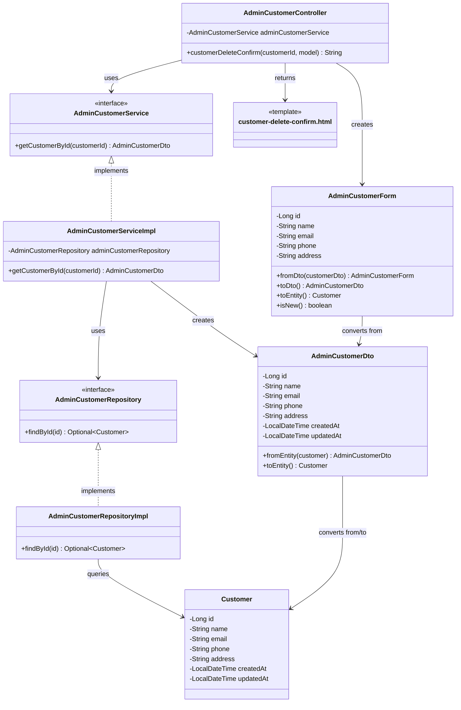

# クラス図_顧客削除確認

## クラス図

## クラス図の解説

### クラス間の関係

1. **AdminCustomerController**
   - 管理者顧客管理に関するリクエストを処理するコントローラー
   - `AdminCustomerService`を依存性注入で使用
   - `customerDeleteConfirm`メソッドで顧客削除確認画面の表示とデータの取得を行う

2. **AdminCustomerService**
   - 管理者向け顧客管理サービスのインターフェース
   - 顧客詳細の取得機能を定義

3. **AdminCustomerServiceImpl**
   - サービスインターフェースの実装クラス
   - `AdminCustomerRepository`を使用してデータアクセスを行う
   - 顧客IDに基づいて顧客詳細を取得し、`AdminCustomerDto`に変換

4. **AdminCustomerRepository**
   - 管理者向け顧客データアクセス層のインターフェース
   - 顧客詳細の取得機能を定義

5. **AdminCustomerRepositoryImpl**
   - リポジトリインターフェースの実装クラス
   - データベースから顧客データを取得する処理を実装

6. **AdminCustomerForm**
   - 管理者向け顧客フォームクラス
   - 顧客の表示データを管理する
   - `AdminCustomerDto`と`Customer`エンティティとの相互変換機能を提供

7. **AdminCustomerDto**
   - 管理者向け顧客情報のデータ転送オブジェクト
   - `Customer`エンティティとの相互変換機能を提供

8. **Customer**
   - 顧客情報を管理するエンティティクラス
   - データベースの顧客テーブルに対応

9. **customer-delete-confirm.html**
   - 管理者顧客削除確認画面のテンプレートファイル
   - 顧客削除の確認フォームを表示

### 処理フロー

1. ユーザーが`/admin/customers/{id}/delete`にアクセス
2. `AdminCustomerController.customerDeleteConfirm()`が呼び出される
3. 顧客IDを取得
4. `AdminCustomerService.getCustomerById()`で顧客詳細を取得
5. `AdminCustomerRepository`を使用してデータベースから顧客を検索
6. 検索結果を`AdminCustomerDto`に変換
7. `AdminCustomerForm.fromDto()`でフォームに変換
8. フォームをモデルに追加
9. `customer-delete-confirm.html`テンプレートが返される
10. 顧客削除確認画面が表示される 