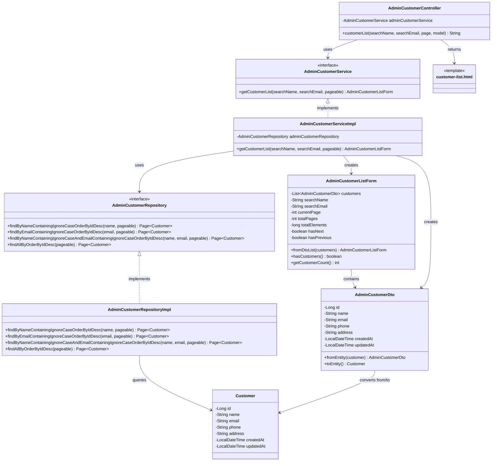

# クラス図_顧客一覧表示

## クラス図

## クラス図の解説

### クラス間の関係

1. **AdminCustomerController**
   - 管理者顧客管理に関するリクエストを処理するコントローラー
   - `AdminCustomerService`を依存性注入で使用
   - `customerList`メソッドで顧客一覧画面の表示とデータの取得を行う

2. **AdminCustomerService**
   - 管理者向け顧客管理サービスのインターフェース
   - 顧客一覧の取得機能を定義

3. **AdminCustomerServiceImpl**
   - サービスインターフェースの実装クラス
   - `AdminCustomerRepository`を使用してデータアクセスを行う
   - 検索条件に応じて顧客一覧を取得し、`AdminCustomerListForm`を作成

4. **AdminCustomerRepository**
   - 管理者向け顧客データアクセス層のインターフェース
   - 顧客名・メールアドレスによる検索機能とページング機能を定義

5. **AdminCustomerRepositoryImpl**
   - リポジトリインターフェースの実装クラス
   - データベースから顧客データを検索・取得する処理を実装

6. **AdminCustomerListForm**
   - 管理者向け顧客一覧フォームクラス
   - 顧客一覧の表示データとページング情報を管理
   - 検索条件とページング情報を含む

7. **AdminCustomerDto**
   - 管理者向け顧客情報のデータ転送オブジェクト
   - `Customer`エンティティとの相互変換機能を提供

8. **Customer**
   - 顧客情報を管理するエンティティクラス
   - データベースの顧客テーブルに対応

9. **customer-list.html**
   - 管理者顧客一覧画面のテンプレートファイル
   - 顧客一覧と検索フォームを表示

### 処理フロー

1. ユーザーが`/admin/customers`にアクセス
2. `AdminCustomerController.customerList()`が呼び出される
3. 検索条件（顧客名、メールアドレス）とページ番号を取得
4. `AdminCustomerService.getCustomerList()`で顧客一覧を取得
5. `AdminCustomerRepository`を使用してデータベースから顧客を検索
6. 検索結果を`AdminCustomerDto`に変換
7. `AdminCustomerListForm`を作成してページング情報を設定
8. フォームをモデルに追加
9. `customer-list.html`テンプレートが返される
10. 顧客一覧画面が表示される 