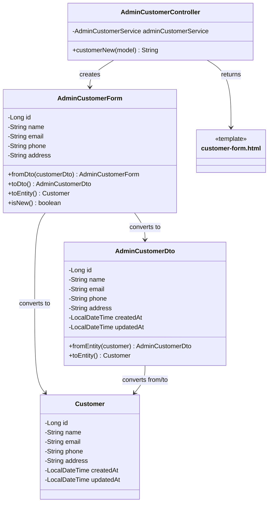

# クラス図_顧客新規作成

## クラス図

## クラス図の解説

### クラス間の関係

1. **AdminCustomerController**
   - 管理者顧客管理に関するリクエストを処理するコントローラー
   - `customerNew`メソッドで顧客新規作成画面の表示を行う

2. **AdminCustomerForm**
   - 管理者向け顧客フォームクラス
   - 顧客の入力データを管理する
   - `AdminCustomerDto`と`Customer`エンティティとの相互変換機能を提供
   - `isNew()`メソッドで新規顧客かどうかを判定

3. **AdminCustomerDto**
   - 管理者向け顧客情報のデータ転送オブジェクト
   - `Customer`エンティティとの相互変換機能を提供

4. **Customer**
   - 顧客情報を管理するエンティティクラス
   - データベースの顧客テーブルに対応

5. **customer-form.html**
   - 管理者顧客フォーム画面のテンプレートファイル
   - 顧客の新規作成・編集フォームを表示

### 処理フロー

1. ユーザーが`/admin/customers/new`にアクセス
2. `AdminCustomerController.customerNew()`が呼び出される
3. `AdminCustomerForm`インスタンスが作成される
4. フォームをモデルに追加
5. `customer-form.html`テンプレートが返される
6. 顧客新規作成画面が表示される 