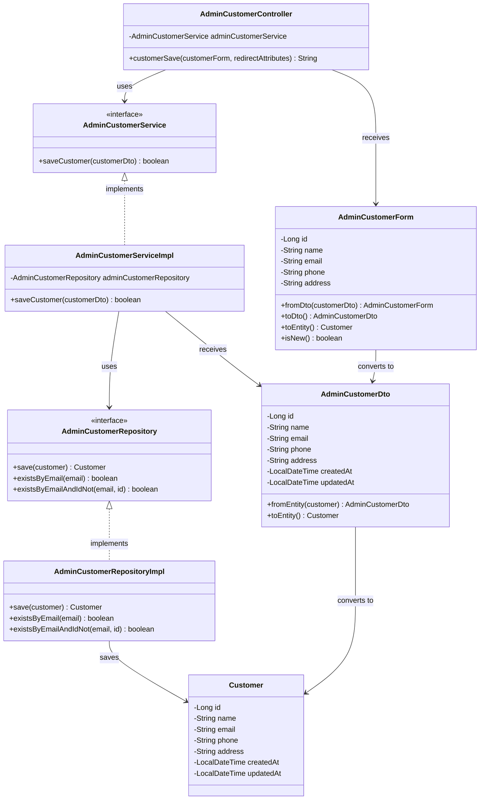

# クラス図_顧客保存

## クラス図

## クラス図の解説

### クラス間の関係

1. **AdminCustomerController**
   - 管理者顧客管理に関するリクエストを処理するコントローラー
   - `AdminCustomerService`を依存性注入で使用
   - `customerSave`メソッドで顧客保存処理を行う

2. **AdminCustomerService**
   - 管理者向け顧客管理サービスのインターフェース
   - 顧客保存機能を定義

3. **AdminCustomerServiceImpl**
   - サービスインターフェースの実装クラス
   - `AdminCustomerRepository`を使用してデータアクセスを行う
   - 顧客の新規作成・更新処理を実装

4. **AdminCustomerRepository**
   - 管理者向け顧客データアクセス層のインターフェース
   - 顧客保存機能とメールアドレス重複チェック機能を定義

5. **AdminCustomerRepositoryImpl**
   - リポジトリインターフェースの実装クラス
   - データベースへの顧客保存処理を実装

6. **AdminCustomerForm**
   - 管理者向け顧客フォームクラス
   - 顧客の入力データを管理する
   - `AdminCustomerDto`と`Customer`エンティティとの相互変換機能を提供
   - `isNew()`メソッドで新規顧客かどうかを判定

7. **AdminCustomerDto**
   - 管理者向け顧客情報のデータ転送オブジェクト
   - `Customer`エンティティとの相互変換機能を提供

8. **Customer**
   - 顧客情報を管理するエンティティクラス
   - データベースの顧客テーブルに対応

### 処理フロー

1. ユーザーが顧客フォームから保存リクエストを送信
2. `AdminCustomerController.customerSave()`が呼び出される
3. `AdminCustomerForm`から`AdminCustomerDto`に変換
4. `AdminCustomerService.saveCustomer()`で顧客保存処理を実行
5. `AdminCustomerRepository`を使用してデータベースに顧客を保存
6. 保存結果に応じてメッセージを設定
7. 顧客一覧画面にリダイレクト 