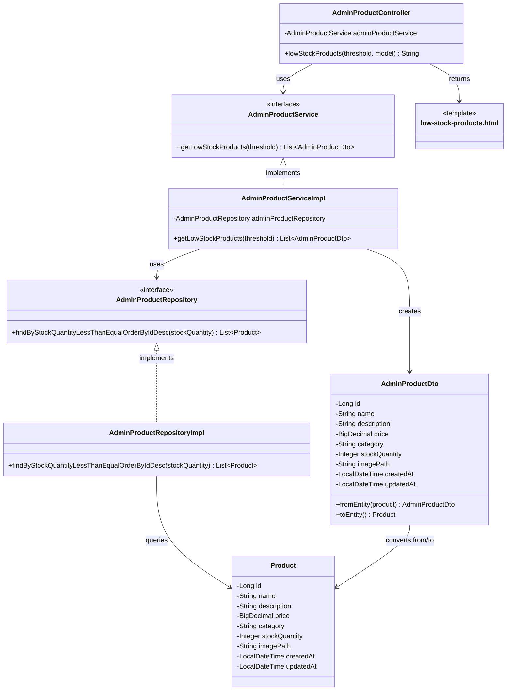

# クラス図_在庫不足商品表示

## クラス図

## クラス図の解説

### クラス間の関係

1. **AdminProductController**
   - 管理者商品管理に関するリクエストを処理するコントローラー
   - `AdminProductService`を依存性注入で使用
   - `lowStockProducts`メソッドで在庫不足商品一覧画面の表示とデータの取得を行う

2. **AdminProductService**
   - 管理者向け商品管理サービスのインターフェース
   - 在庫不足商品の取得機能を定義

3. **AdminProductServiceImpl**
   - サービスインターフェースの実装クラス
   - `AdminProductRepository`を使用してデータアクセスを行う
   - 在庫閾値に基づいて在庫不足商品を取得し、`AdminProductDto`に変換

4. **AdminProductRepository**
   - 管理者向け商品データアクセス層のインターフェース
   - 在庫不足商品の取得機能を定義

5. **AdminProductRepositoryImpl**
   - リポジトリインターフェースの実装クラス
   - データベースから在庫不足商品データを取得する処理を実装

6. **AdminProductDto**
   - 管理者向け商品情報のデータ転送オブジェクト
   - `Product`エンティティとの相互変換機能を提供

7. **Product**
   - 商品情報を管理するエンティティクラス
   - データベースの商品テーブルに対応

8. **low-stock-products.html**
   - 管理者在庫不足商品一覧画面のテンプレートファイル
   - 在庫不足商品一覧を表示

### 処理フロー

1. ユーザーが`/admin/products/low-stock`にアクセス
2. `AdminProductController.lowStockProducts()`が呼び出される
3. 在庫閾値を取得（デフォルト値: 10）
4. `AdminProductService.getLowStockProducts()`で在庫不足商品を取得
5. `AdminProductRepository`を使用してデータベースから在庫不足商品を検索
6. 検索結果を`AdminProductDto`に変換
7. 在庫不足商品一覧と閾値をモデルに追加
8. `low-stock-products.html`テンプレートが返される
9. 在庫不足商品一覧画面が表示される 