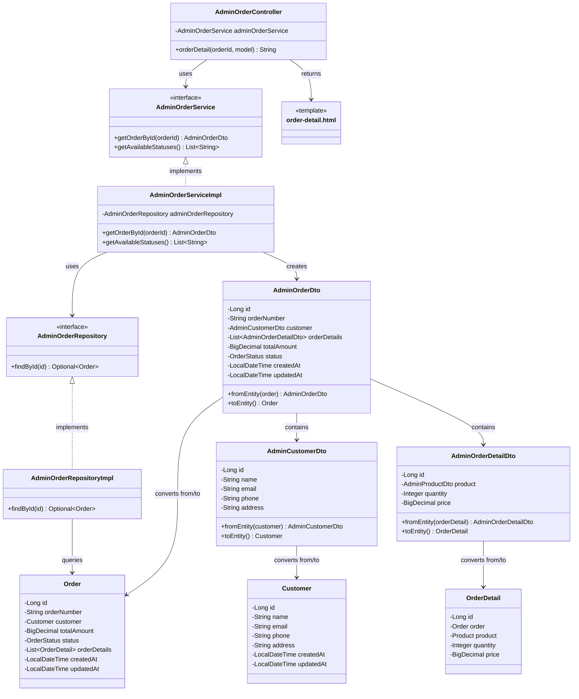

# クラス図_注文詳細表示

## クラス図

## クラス図の解説

### クラス間の関係

1. **AdminOrderController**
   - 管理者注文管理に関するリクエストを処理するコントローラー
   - `AdminOrderService`を依存性注入で使用
   - `orderDetail`メソッドで注文詳細画面の表示とデータの取得を行う

2. **AdminOrderService**
   - 管理者向け注文管理サービスのインターフェース
   - 注文詳細の取得機能と利用可能なステータスの取得機能を定義

3. **AdminOrderServiceImpl**
   - サービスインターフェースの実装クラス
   - `AdminOrderRepository`を使用してデータアクセスを行う
   - 注文IDに基づいて注文詳細を取得し、`AdminOrderDto`に変換

4. **AdminOrderRepository**
   - 管理者向け注文データアクセス層のインターフェース
   - 注文詳細の取得機能を定義

5. **AdminOrderRepositoryImpl**
   - リポジトリインターフェースの実装クラス
   - データベースから注文データを取得する処理を実装

6. **AdminOrderDto**
   - 管理者向け注文情報のデータ転送オブジェクト
   - `Order`エンティティとの相互変換機能を提供
   - `AdminCustomerDto`と`AdminOrderDetailDto`を含む

7. **AdminCustomerDto**
   - 管理者向け顧客情報のデータ転送オブジェクト
   - `Customer`エンティティとの相互変換機能を提供

8. **AdminOrderDetailDto**
   - 管理者向け注文詳細情報のデータ転送オブジェクト
   - `OrderDetail`エンティティとの相互変換機能を提供

9. **Order**
   - 注文情報を管理するエンティティクラス
   - データベースの注文テーブルに対応

10. **Customer**
    - 顧客情報を管理するエンティティクラス
    - データベースの顧客テーブルに対応

11. **OrderDetail**
    - 注文詳細情報を管理するエンティティクラス
    - データベースの注文詳細テーブルに対応

12. **order-detail.html**
    - 管理者注文詳細画面のテンプレートファイル
    - 注文詳細とステータス更新フォームを表示

### 処理フロー

1. ユーザーが`/admin/orders/{id}`にアクセス
2. `AdminOrderController.orderDetail()`が呼び出される
3. 注文IDを取得
4. `AdminOrderService.getOrderById()`で注文詳細を取得
5. `AdminOrderRepository`を使用してデータベースから注文を検索
6. 検索結果を`AdminOrderDto`に変換
7. `AdminOrderService.getAvailableStatuses()`で利用可能なステータス一覧を取得
8. 注文詳細とステータス一覧をモデルに追加
9. `order-detail.html`テンプレートが返される
10. 注文詳細画面が表示される 