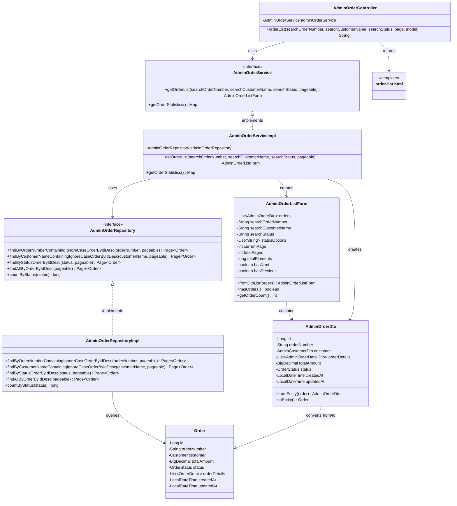

# クラス図_注文一覧表示

## クラス図

## クラス図の解説

### クラス間の関係

1. **AdminOrderController**
   - 管理者注文管理に関するリクエストを処理するコントローラー
   - `AdminOrderService`を依存性注入で使用
   - `orderList`メソッドで注文一覧画面の表示とデータの取得を行う

2. **AdminOrderService**
   - 管理者向け注文管理サービスのインターフェース
   - 注文一覧の取得機能と統計情報の取得機能を定義

3. **AdminOrderServiceImpl**
   - サービスインターフェースの実装クラス
   - `AdminOrderRepository`を使用してデータアクセスを行う
   - 検索条件に応じて注文一覧を取得し、`AdminOrderListForm`を作成

4. **AdminOrderRepository**
   - 管理者向け注文データアクセス層のインターフェース
   - 注文番号・顧客名・ステータスによる検索機能とページング機能を定義

5. **AdminOrderRepositoryImpl**
   - リポジトリインターフェースの実装クラス
   - データベースから注文データを検索・取得する処理を実装

6. **AdminOrderListForm**
   - 管理者向け注文一覧フォームクラス
   - 注文一覧の表示データとページング情報を管理
   - 検索条件とページング情報を含む

7. **AdminOrderDto**
   - 管理者向け注文情報のデータ転送オブジェクト
   - `Order`エンティティとの相互変換機能を提供

8. **Order**
   - 注文情報を管理するエンティティクラス
   - データベースの注文テーブルに対応

9. **order-list.html**
   - 管理者注文一覧画面のテンプレートファイル
   - 注文一覧と検索フォームを表示

### 処理フロー

1. ユーザーが`/admin/orders`にアクセス
2. `AdminOrderController.orderList()`が呼び出される
3. 検索条件（注文番号、顧客名、ステータス）とページ番号を取得
4. `AdminOrderService.getOrderList()`で注文一覧を取得
5. `AdminOrderRepository`を使用してデータベースから注文を検索
6. 検索結果を`AdminOrderDto`に変換
7. `AdminOrderListForm`を作成してページング情報を設定
8. `AdminOrderService.getOrderStatistics()`で統計情報を取得
9. フォームと統計情報をモデルに追加
10. `order-list.html`テンプレートが返される
11. 注文一覧画面が表示される 