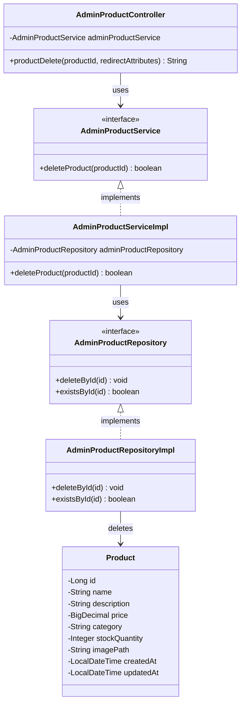

# クラス図_商品削除

## クラス図

## クラス図の解説

### クラス間の関係

1. **AdminProductController**
   - 管理者商品管理に関するリクエストを処理するコントローラー
   - `AdminProductService`を依存性注入で使用
   - `productDelete`メソッドで商品削除処理を行う

2. **AdminProductService**
   - 管理者向け商品管理サービスのインターフェース
   - 商品削除機能を定義

3. **AdminProductServiceImpl**
   - サービスインターフェースの実装クラス
   - `AdminProductRepository`を使用してデータアクセスを行う
   - 商品削除処理を実装

4. **AdminProductRepository**
   - 管理者向け商品データアクセス層のインターフェース
   - 商品削除機能と存在確認機能を定義

5. **AdminProductRepositoryImpl**
   - リポジトリインターフェースの実装クラス
   - データベースからの商品削除処理を実装

6. **Product**
   - 商品情報を管理するエンティティクラス
   - データベースの商品テーブルに対応

### 処理フロー

1. ユーザーが商品削除確認画面から削除リクエストを送信
2. `AdminProductController.productDelete()`が呼び出される
3. 商品IDを取得
4. `AdminProductService.deleteProduct()`で商品削除処理を実行
5. `AdminProductRepository`を使用してデータベースから商品を削除
6. 削除結果に応じてメッセージを設定
7. 商品一覧画面にリダイレクト 