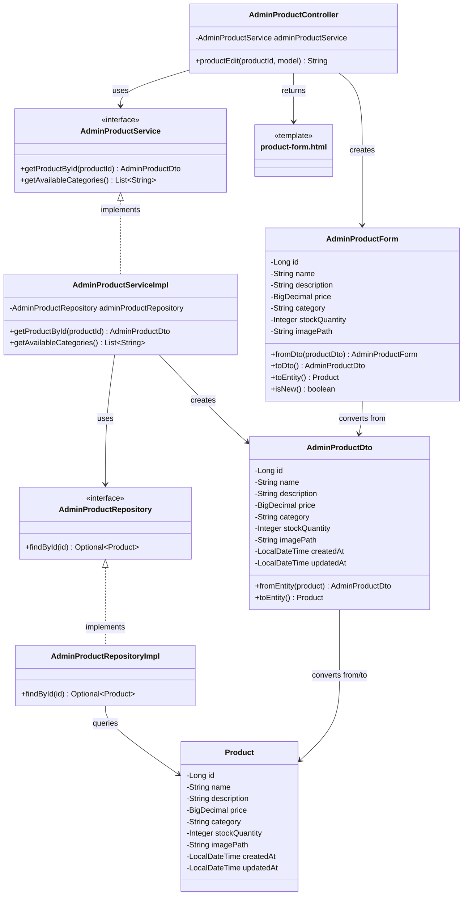

# クラス図_商品編集

## クラス図

## クラス図の解説

### クラス間の関係

1. **AdminProductController**
   - 管理者商品管理に関するリクエストを処理するコントローラー
   - `AdminProductService`を依存性注入で使用
   - `productEdit`メソッドで商品編集画面の表示とデータの取得を行う

2. **AdminProductService**
   - 管理者向け商品管理サービスのインターフェース
   - 商品詳細の取得機能と利用可能なカテゴリの取得機能を定義

3. **AdminProductServiceImpl**
   - サービスインターフェースの実装クラス
   - `AdminProductRepository`を使用してデータアクセスを行う
   - 商品IDに基づいて商品詳細を取得し、`AdminProductDto`に変換

4. **AdminProductRepository**
   - 管理者向け商品データアクセス層のインターフェース
   - 商品詳細の取得機能を定義

5. **AdminProductRepositoryImpl**
   - リポジトリインターフェースの実装クラス
   - データベースから商品データを取得する処理を実装

6. **AdminProductForm**
   - 管理者向け商品フォームクラス
   - 商品の入力データを管理する
   - `AdminProductDto`と`Product`エンティティとの相互変換機能を提供

7. **AdminProductDto**
   - 管理者向け商品情報のデータ転送オブジェクト
   - `Product`エンティティとの相互変換機能を提供

8. **Product**
   - 商品情報を管理するエンティティクラス
   - データベースの商品テーブルに対応

9. **product-form.html**
   - 管理者商品フォーム画面のテンプレートファイル
   - 商品の新規作成・編集フォームを表示

### 処理フロー

1. ユーザーが`/admin/products/{id}/edit`にアクセス
2. `AdminProductController.productEdit()`が呼び出される
3. 商品IDを取得
4. `AdminProductService.getProductById()`で商品詳細を取得
5. `AdminProductRepository`を使用してデータベースから商品を検索
6. 検索結果を`AdminProductDto`に変換
7. `AdminProductForm.fromDto()`でフォームに変換
8. `AdminProductService.getAvailableCategories()`で利用可能なカテゴリ一覧を取得
9. フォームとカテゴリ一覧をモデルに追加
10. `product-form.html`テンプレートが返される
11. 商品編集画面が表示される 