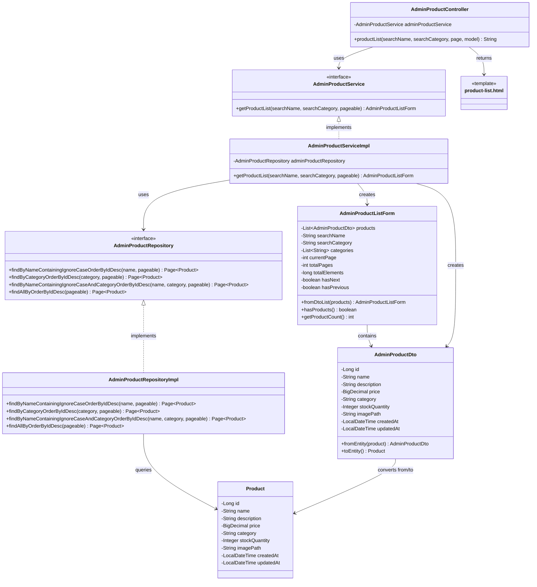

# クラス図_商品一覧表示

## クラス図

## クラス図の解説

### クラス間の関係

1. **AdminProductController**
   - 管理者商品管理に関するリクエストを処理するコントローラー
   - `AdminProductService`を依存性注入で使用
   - `productList`メソッドで商品一覧画面の表示とデータの取得を行う

2. **AdminProductService**
   - 管理者向け商品管理サービスのインターフェース
   - 商品一覧の取得機能を定義

3. **AdminProductServiceImpl**
   - サービスインターフェースの実装クラス
   - `AdminProductRepository`を使用してデータアクセスを行う
   - 検索条件に応じて商品一覧を取得し、`AdminProductListForm`を作成

4. **AdminProductRepository**
   - 管理者向け商品データアクセス層のインターフェース
   - 商品名・カテゴリによる検索機能とページング機能を定義

5. **AdminProductRepositoryImpl**
   - リポジトリインターフェースの実装クラス
   - データベースから商品データを検索・取得する処理を実装

6. **AdminProductListForm**
   - 管理者向け商品一覧フォームクラス
   - 商品一覧の表示データとページング情報を管理
   - 検索条件とページング情報を含む

7. **AdminProductDto**
   - 管理者向け商品情報のデータ転送オブジェクト
   - `Product`エンティティとの相互変換機能を提供

8. **Product**
   - 商品情報を管理するエンティティクラス
   - データベースの商品テーブルに対応

9. **product-list.html**
   - 管理者商品一覧画面のテンプレートファイル
   - 商品一覧と検索フォームを表示

### 処理フロー

1. ユーザーが`/admin/products`にアクセス
2. `AdminProductController.productList()`が呼び出される
3. 検索条件（商品名、カテゴリ）とページ番号を取得
4. `AdminProductService.getProductList()`で商品一覧を取得
5. `AdminProductRepository`を使用してデータベースから商品を検索
6. 検索結果を`AdminProductDto`に変換
7. `AdminProductListForm`を作成してページング情報を設定
8. フォームをモデルに追加
9. `product-list.html`テンプレートが返される
10. 商品一覧画面が表示される 