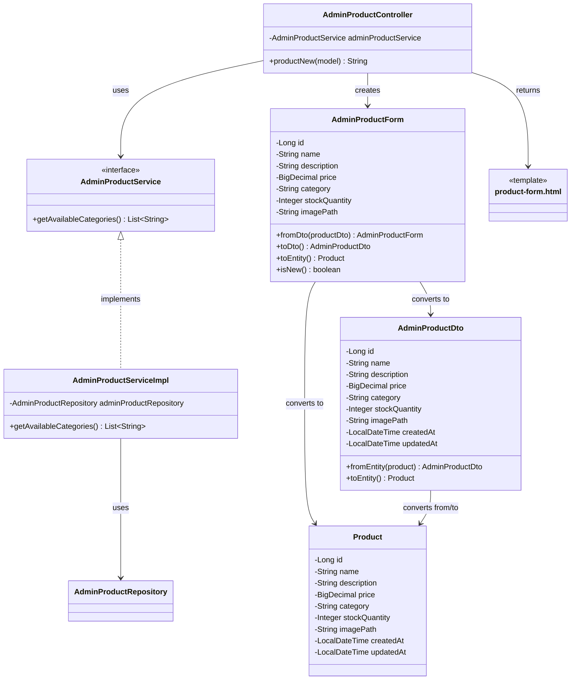

# クラス図_商品新規作成

## クラス図

## クラス図の解説

### クラス間の関係

1. **AdminProductController**
   - 管理者商品管理に関するリクエストを処理するコントローラー
   - `AdminProductService`を依存性注入で使用
   - `productNew`メソッドで商品新規作成画面の表示を行う

2. **AdminProductService**
   - 管理者向け商品管理サービスのインターフェース
   - 利用可能なカテゴリの取得機能を定義

3. **AdminProductServiceImpl**
   - サービスインターフェースの実装クラス
   - `AdminProductRepository`を使用して利用可能なカテゴリを取得

4. **AdminProductForm**
   - 管理者向け商品フォームクラス
   - 商品の入力データを管理する
   - `AdminProductDto`と`Product`エンティティとの相互変換機能を提供
   - `isNew()`メソッドで新規商品かどうかを判定

5. **AdminProductDto**
   - 管理者向け商品情報のデータ転送オブジェクト
   - `Product`エンティティとの相互変換機能を提供

6. **Product**
   - 商品情報を管理するエンティティクラス
   - データベースの商品テーブルに対応

7. **product-form.html**
   - 管理者商品フォーム画面のテンプレートファイル
   - 商品の新規作成・編集フォームを表示

### 処理フロー

1. ユーザーが`/admin/products/new`にアクセス
2. `AdminProductController.productNew()`が呼び出される
3. `AdminProductForm`インスタンスが作成される
4. `AdminProductService.getAvailableCategories()`で利用可能なカテゴリ一覧を取得
5. フォームとカテゴリ一覧をモデルに追加
6. `product-form.html`テンプレートが返される
7. 商品新規作成画面が表示される 