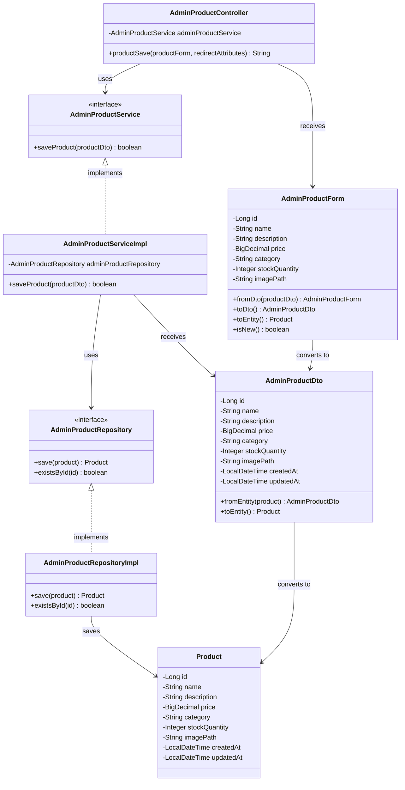

# クラス図_商品保存

## クラス図

## クラス図の解説

### クラス間の関係

1. **AdminProductController**
   - 管理者商品管理に関するリクエストを処理するコントローラー
   - `AdminProductService`を依存性注入で使用
   - `productSave`メソッドで商品保存処理を行う

2. **AdminProductService**
   - 管理者向け商品管理サービスのインターフェース
   - 商品保存機能を定義

3. **AdminProductServiceImpl**
   - サービスインターフェースの実装クラス
   - `AdminProductRepository`を使用してデータアクセスを行う
   - 商品の新規作成・更新処理を実装

4. **AdminProductRepository**
   - 管理者向け商品データアクセス層のインターフェース
   - 商品保存機能と存在確認機能を定義

5. **AdminProductRepositoryImpl**
   - リポジトリインターフェースの実装クラス
   - データベースへの商品保存処理を実装

6. **AdminProductForm**
   - 管理者向け商品フォームクラス
   - 商品の入力データを管理する
   - `AdminProductDto`と`Product`エンティティとの相互変換機能を提供
   - `isNew()`メソッドで新規商品かどうかを判定

7. **AdminProductDto**
   - 管理者向け商品情報のデータ転送オブジェクト
   - `Product`エンティティとの相互変換機能を提供

8. **Product**
   - 商品情報を管理するエンティティクラス
   - データベースの商品テーブルに対応

### 処理フロー

1. ユーザーが商品フォームから保存リクエストを送信
2. `AdminProductController.productSave()`が呼び出される
3. `AdminProductForm`から`AdminProductDto`に変換
4. `AdminProductService.saveProduct()`で商品保存処理を実行
5. `AdminProductRepository`を使用してデータベースに商品を保存
6. 保存結果に応じてメッセージを設定
7. 商品一覧画面にリダイレクト 