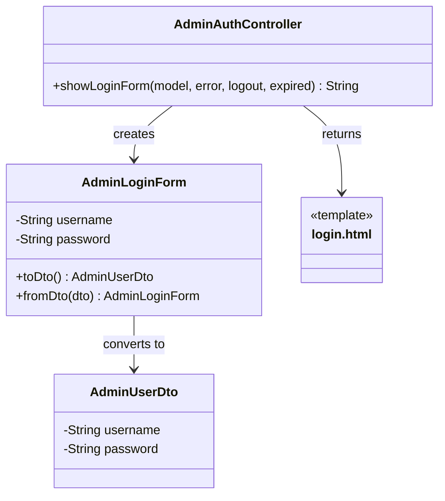

# クラス図_管理者ログイン

## クラス図

## クラス図の解説

### クラス間の関係

1. **AdminAuthController**
   - 管理者認証に関するリクエストを処理するコントローラー
   - `showLoginForm`メソッドでログイン画面の表示とフォームの初期化を行う
   - `AdminLoginForm`インスタンスを作成してモデルに追加する

2. **AdminLoginForm**
   - ログイン画面のフォームデータを管理するクラス
   - ユーザー名とパスワードのフィールドを持つ
   - `toDto()`メソッドで`AdminUserDto`に変換する機能を提供
   - `fromDto()`メソッドで`AdminUserDto`からフォームに変換する機能を提供

3. **AdminUserDto**
   - 管理者ユーザー情報のデータ転送オブジェクト
   - ユーザー名とパスワードの情報を管理

4. **login.html**
   - 管理者ログイン画面のテンプレートファイル
   - ユーザー名とパスワードの入力フォームを表示

### 処理フロー

1. ユーザーが`/admin/login`にアクセス
2. `AdminAuthController.showLoginForm()`が呼び出される
3. `AdminLoginForm`インスタンスが作成される
4. フォームがモデルに追加される
5. `login.html`テンプレートが返される
6. ログイン画面が表示される 