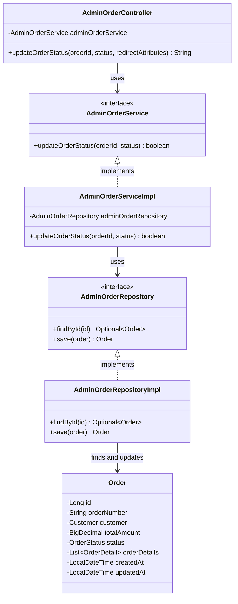

# クラス図_注文ステータス更新

## クラス図

## クラス図の解説

### クラス間の関係

1. **AdminOrderController**
   - 管理者注文管理に関するリクエストを処理するコントローラー
   - `AdminOrderService`を依存性注入で使用
   - `updateOrderStatus`メソッドで注文ステータス更新処理を行う

2. **AdminOrderService**
   - 管理者向け注文管理サービスのインターフェース
   - 注文ステータス更新機能を定義

3. **AdminOrderServiceImpl**
   - サービスインターフェースの実装クラス
   - `AdminOrderRepository`を使用してデータアクセスを行う
   - 注文ステータス更新処理を実装

4. **AdminOrderRepository**
   - 管理者向け注文データアクセス層のインターフェース
   - 注文取得機能と保存機能を定義

5. **AdminOrderRepositoryImpl**
   - リポジトリインターフェースの実装クラス
   - データベースから注文を取得し、更新処理を実装

6. **Order**
   - 注文情報を管理するエンティティクラス
   - データベースの注文テーブルに対応
   - ステータス情報を含む

### 処理フロー

1. ユーザーが注文詳細画面からステータス更新リクエストを送信
2. `AdminOrderController.updateOrderStatus()`が呼び出される
3. 注文IDと新しいステータスを取得
4. `AdminOrderService.updateOrderStatus()`で注文ステータス更新処理を実行
5. `AdminOrderRepository`を使用してデータベースから注文を取得
6. 注文のステータスを更新してデータベースに保存
7. 更新結果に応じてメッセージを設定
8. 注文詳細画面にリダイレクト 