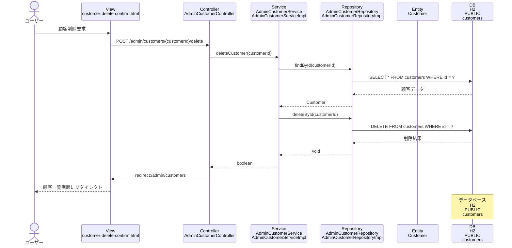

# シーケンス図_顧客削除

## シーケンス図

## シーケンス図の解説

### 処理フロー
1. **ユーザーが顧客削除を要求**
   - ユーザーが顧客削除確認画面で削除を実行

2. **ViewからControllerへのリクエスト**
   - `customer-delete-confirm.html`から`AdminCustomerController`の`customerDelete`メソッドにPOSTリクエスト
   - 顧客IDをパスパラメータとして受け取る

3. **ControllerからServiceへの処理委譲**
   - `AdminCustomerController`が`AdminCustomerService`の`deleteCustomer`メソッドを呼び出し
   - 指定された顧客IDで削除処理を実行

4. **ServiceからRepositoryへのデータ取得**
   - `AdminCustomerServiceImpl`が`AdminCustomerRepository`の`findById`メソッドを呼び出し
   - 削除対象の顧客データを取得

5. **データベースアクセス（取得）**
   - `AdminCustomerRepositoryImpl`がH2データベースのcustomersテーブルから顧客データを取得

6. **ServiceからRepositoryへの削除処理**
   - `AdminCustomerServiceImpl`が`AdminCustomerRepository`の`deleteById`メソッドを呼び出し
   - データベースから顧客データを削除

7. **データベースアクセス（削除）**
   - `AdminCustomerRepositoryImpl`がH2データベースのcustomersテーブルからDELETEを実行
   - 指定されたIDの顧客データを削除

8. **処理結果の返却**
   - 削除処理の成功/失敗をboolean値で返却

9. **リダイレクト処理**
   - `AdminCustomerController`が顧客一覧画面にリダイレクト
   - 成功/失敗メッセージをFlash属性に設定

10. **画面表示**
    - 顧客一覧画面が表示され、削除結果が表示される

### 主要なクラスとメソッド
- **AdminCustomerController.customerDelete()**: 顧客削除のエントリーポイント
- **AdminCustomerService.deleteCustomer()**: 顧客削除のビジネスロジック
- **AdminCustomerRepository.deleteById()**: データベースからの顧客データ削除
- **AdminCustomerRepository.findById()**: 削除対象顧客の存在確認 