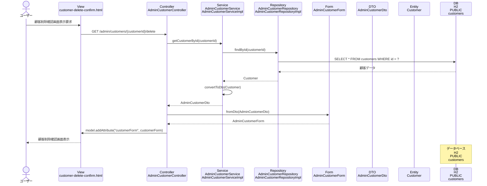

# シーケンス図_顧客削除確認

## シーケンス図

## シーケンス図の解説

### 処理フロー
1. **ユーザーが顧客削除確認画面表示を要求**
   - ユーザーが特定の顧客の削除確認画面にアクセス

2. **ViewからControllerへのリクエスト**
   - `customer-delete-confirm.html`から`AdminCustomerController`の`customerDeleteConfirm`メソッドにGETリクエスト
   - 顧客IDをパスパラメータとして受け取る

3. **ControllerからServiceへの処理委譲**
   - `AdminCustomerController`が`AdminCustomerService`の`getCustomerById`メソッドを呼び出し
   - 指定された顧客IDで顧客データを取得

4. **ServiceからRepositoryへのデータ取得**
   - `AdminCustomerServiceImpl`が`AdminCustomerRepository`の`findById`メソッドを呼び出し
   - データベースから特定の顧客データを取得

5. **データベースアクセス**
   - `AdminCustomerRepositoryImpl`がH2データベースのcustomersテーブルにクエリを実行
   - 指定されたIDの顧客データを取得

6. **EntityからDTOへの変換**
   - 取得した`Customer`エンティティを`AdminCustomerDto`に変換

7. **DTOからFormへの変換**
   - `AdminCustomerController`が`AdminCustomerForm.fromDto`メソッドを呼び出し
   - DTOからフォームオブジェクトに変換

8. **Viewへのデータ設定**
   - `AdminCustomerController`がModelに`customerForm`を設定

9. **画面表示**
   - `customer-delete-confirm.html`テンプレートが顧客削除確認フォームを表示

### 主要なクラスとメソッド
- **AdminCustomerController.customerDeleteConfirm()**: 顧客削除確認画面表示のエントリーポイント
- **AdminCustomerService.getCustomerById()**: 顧客詳細取得のビジネスロジック
- **AdminCustomerRepository.findById()**: データベースからの特定顧客データ取得
- **AdminCustomerForm.fromDto()**: DTOからフォームへの変換メソッド 