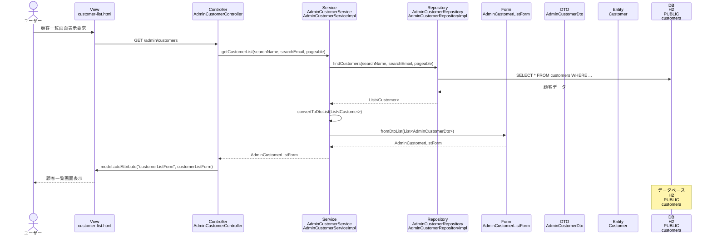

# シーケンス図_顧客一覧表示

## シーケンス図

## シーケンス図の解説

### 処理フロー
1. **ユーザーが顧客一覧画面表示を要求**
   - ユーザーがブラウザで顧客一覧画面にアクセス

2. **ViewからControllerへのリクエスト**
   - `customer-list.html`から`AdminCustomerController`の`customerList`メソッドにGETリクエスト

3. **ControllerからServiceへの処理委譲**
   - `AdminCustomerController`が`AdminCustomerService`の`getCustomerList`メソッドを呼び出し
   - 検索条件（顧客名、メールアドレス）とページング情報を渡す

4. **ServiceからRepositoryへのデータ取得**
   - `AdminCustomerServiceImpl`が`AdminCustomerRepository`の`findCustomers`メソッドを呼び出し
   - データベースから顧客データを取得

5. **データベースアクセス**
   - `AdminCustomerRepositoryImpl`がH2データベースのcustomersテーブルにクエリを実行
   - 検索条件に基づいて顧客データを取得

6. **EntityからDTOへの変換**
   - 取得した`Customer`エンティティを`AdminCustomerDto`に変換
   - `AdminCustomerListForm`にDTOリストを設定

7. **Viewへのデータ設定**
   - `AdminCustomerController`がModelに`customerListForm`を設定

8. **画面表示**
   - `customer-list.html`テンプレートが顧客一覧を表示

### 主要なクラスとメソッド
- **AdminCustomerController.customerList()**: 顧客一覧表示のエントリーポイント
- **AdminCustomerService.getCustomerList()**: 顧客一覧取得のビジネスロジック
- **AdminCustomerRepository.findCustomers()**: データベースからの顧客データ取得
- **AdminCustomerListForm**: 顧客一覧の表示データを管理するフォームクラス 