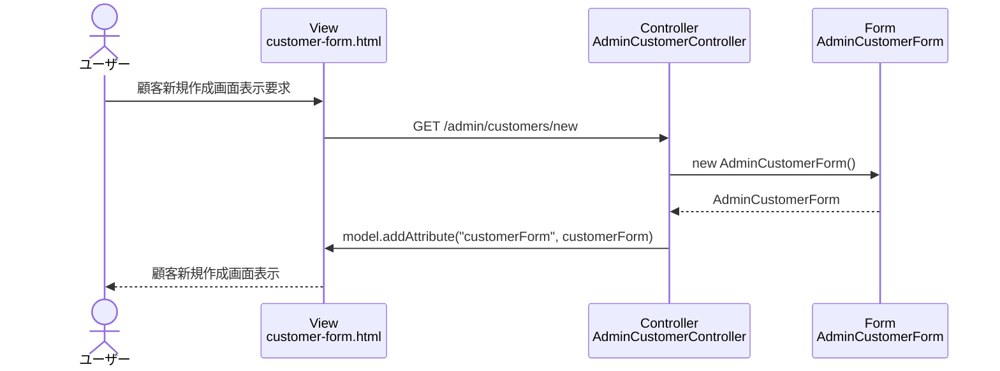

# シーケンス図_顧客新規作成

## シーケンス図

## シーケンス図の解説

### 処理フロー
1. **ユーザーが顧客新規作成画面表示を要求**
   - ユーザーがブラウザで顧客新規作成画面にアクセス

2. **ViewからControllerへのリクエスト**
   - `customer-form.html`から`AdminCustomerController`の`customerNew`メソッドにGETリクエスト

3. **フォームオブジェクトの作成**
   - `AdminCustomerController`が新しい`AdminCustomerForm`インスタンスを作成
   - 空のフォームオブジェクトを初期化

4. **Viewへのデータ設定**
   - `AdminCustomerController`がModelに`customerForm`を設定

5. **画面表示**
   - `customer-form.html`テンプレートが顧客新規作成フォームを表示

### 主要なクラスとメソッド
- **AdminCustomerController.customerNew()**: 顧客新規作成画面表示のエントリーポイント
- **AdminCustomerForm**: 顧客の入力データを管理するフォームクラス 