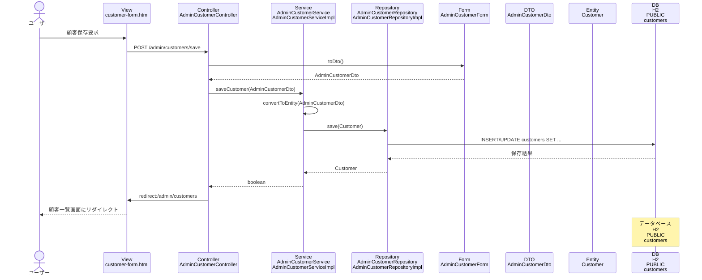

# シーケンス図_顧客保存

## シーケンス図

## シーケンス図の解説

### 処理フロー
1. **ユーザーが顧客保存を要求**
   - ユーザーが顧客フォーム画面で顧客情報を入力して送信

2. **ViewからControllerへのリクエスト**
   - `customer-form.html`から`AdminCustomerController`の`customerSave`メソッドにPOSTリクエスト
   - 顧客情報をフォームデータとして受け取る

3. **FormからDTOへの変換**
   - `AdminCustomerController`が`AdminCustomerForm.toDto`メソッドを呼び出し
   - フォームデータをDTOオブジェクトに変換

4. **ControllerからServiceへの処理委譲**
   - `AdminCustomerController`が`AdminCustomerService`の`saveCustomer`メソッドを呼び出し
   - 顧客DTOを渡して保存処理を実行

5. **DTOからEntityへの変換**
   - `AdminCustomerService`がDTOをEntityに変換
   - 新規作成か更新かを判定して処理を分岐

6. **ServiceからRepositoryへの保存処理**
   - `AdminCustomerServiceImpl`が`AdminCustomerRepository`の`save`メソッドを呼び出し
   - データベースに顧客データを保存

7. **データベースアクセス**
   - `AdminCustomerRepositoryImpl`がH2データベースのcustomersテーブルにINSERT/UPDATEを実行
   - 顧客情報をデータベースに保存

8. **処理結果の返却**
   - 保存処理の成功/失敗をboolean値で返却

9. **リダイレクト処理**
   - `AdminCustomerController`が顧客一覧画面にリダイレクト
   - 成功/失敗メッセージをFlash属性に設定

10. **画面表示**
    - 顧客一覧画面が表示され、保存結果が表示される

### 主要なクラスとメソッド
- **AdminCustomerController.customerSave()**: 顧客保存のエントリーポイント
- **AdminCustomerService.saveCustomer()**: 顧客保存のビジネスロジック
- **AdminCustomerRepository.save()**: データベースへの顧客データ保存
- **AdminCustomerForm.toDto()**: フォームからDTOへの変換メソッド 