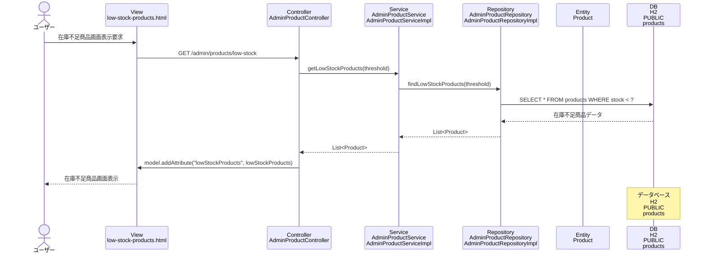

# シーケンス図_在庫不足商品表示

## シーケンス図

## シーケンス図の解説

### 処理フロー
1. **ユーザーが在庫不足商品画面表示を要求**
   - ユーザーがブラウザで在庫不足商品画面にアクセス

2. **ViewからControllerへのリクエスト**
   - `low-stock-products.html`から`AdminProductController`の`lowStockProducts`メソッドにGETリクエスト
   - 在庫閾値をパラメータとして受け取る（デフォルト値: 10）

3. **ControllerからServiceへの処理委譲**
   - `AdminProductController`が`AdminProductService`の`getLowStockProducts`メソッドを呼び出し
   - 在庫閾値を渡して在庫不足商品を取得

4. **ServiceからRepositoryへのデータ取得**
   - `AdminProductServiceImpl`が`AdminProductRepository`の`findLowStockProducts`メソッドを呼び出し
   - データベースから在庫不足商品を取得

5. **データベースアクセス**
   - `AdminProductRepositoryImpl`がH2データベースのproductsテーブルにクエリを実行
   - 在庫数が閾値未満の商品データを取得

6. **Viewへのデータ設定**
   - `AdminProductController`がModelに`lowStockProducts`を設定

7. **画面表示**
   - `low-stock-products.html`テンプレートが在庫不足商品一覧を表示

### 主要なクラスとメソッド
- **AdminProductController.lowStockProducts()**: 在庫不足商品表示のエントリーポイント
- **AdminProductService.getLowStockProducts()**: 在庫不足商品取得のビジネスロジック
- **AdminProductRepository.findLowStockProducts()**: データベースからの在庫不足商品取得 