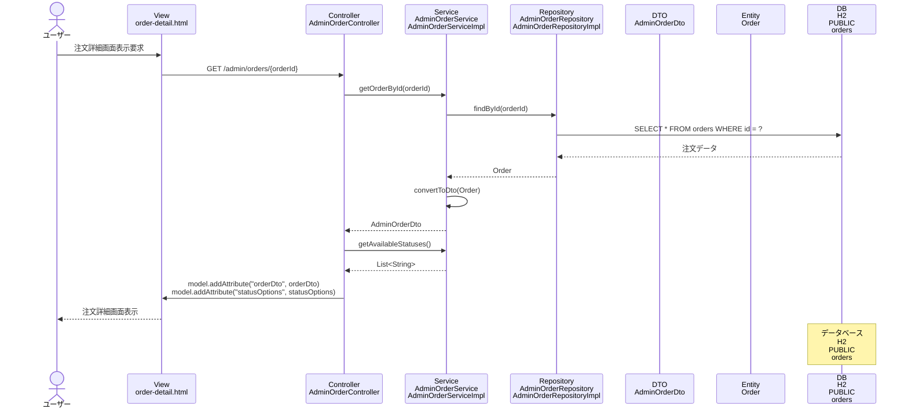

# シーケンス図_注文詳細表示

## シーケンス図

## シーケンス図の解説

### 処理フロー
1. **ユーザーが注文詳細画面表示を要求**
   - ユーザーが特定の注文の詳細画面にアクセス

2. **ViewからControllerへのリクエスト**
   - `order-detail.html`から`AdminOrderController`の`orderDetail`メソッドにGETリクエスト
   - 注文IDをパスパラメータとして受け取る

3. **ControllerからServiceへの処理委譲**
   - `AdminOrderController`が`AdminOrderService`の`getOrderById`メソッドを呼び出し
   - 指定された注文IDで注文データを取得

4. **ServiceからRepositoryへのデータ取得**
   - `AdminOrderServiceImpl`が`AdminOrderRepository`の`findById`メソッドを呼び出し
   - データベースから特定の注文データを取得

5. **データベースアクセス**
   - `AdminOrderRepositoryImpl`がH2データベースのordersテーブルにクエリを実行
   - 指定されたIDの注文データを取得

6. **EntityからDTOへの変換**
   - 取得した`Order`エンティティを`AdminOrderDto`に変換

7. **ステータスオプションの取得**
   - `AdminOrderService`が`getAvailableStatuses`メソッドを呼び出し
   - 利用可能な注文ステータスの一覧を取得

8. **Viewへのデータ設定**
   - `AdminOrderController`がModelに`orderDto`と`statusOptions`を設定

9. **画面表示**
   - `order-detail.html`テンプレートが注文詳細とステータスオプションを表示

### 主要なクラスとメソッド
- **AdminOrderController.orderDetail()**: 注文詳細表示のエントリーポイント
- **AdminOrderService.getOrderById()**: 注文詳細取得のビジネスロジック
- **AdminOrderRepository.findById()**: データベースからの特定注文データ取得
- **AdminOrderDto**: 注文詳細情報を管理するDTOクラス 