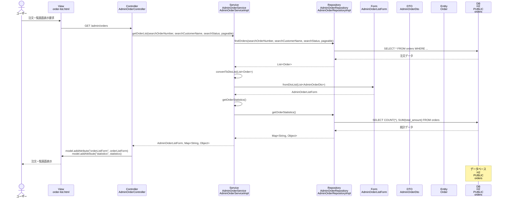

# シーケンス図_注文一覧表示

## シーケンス図

## シーケンス図の解説

### 処理フロー
1. **ユーザーが注文一覧画面表示を要求**
   - ユーザーがブラウザで注文一覧画面にアクセス

2. **ViewからControllerへのリクエスト**
   - `order-list.html`から`AdminOrderController`の`orderList`メソッドにGETリクエスト

3. **ControllerからServiceへの処理委譲**
   - `AdminOrderController`が`AdminOrderService`の`getOrderList`メソッドを呼び出し
   - 検索条件（注文番号、顧客名、ステータス）とページング情報を渡す

4. **ServiceからRepositoryへのデータ取得**
   - `AdminOrderServiceImpl`が`AdminOrderRepository`の`findOrders`メソッドを呼び出し
   - データベースから注文データを取得

5. **データベースアクセス**
   - `AdminOrderRepositoryImpl`がH2データベースのordersテーブルにクエリを実行
   - 検索条件に基づいて注文データを取得

6. **EntityからDTOへの変換**
   - 取得した`Order`エンティティを`AdminOrderDto`に変換
   - `AdminOrderListForm`にDTOリストを設定

7. **統計情報の取得**
   - `AdminOrderService`が`getOrderStatistics`メソッドを呼び出し
   - 注文数や総売上などの統計情報を取得

8. **Viewへのデータ設定**
   - `AdminOrderController`がModelに`orderListForm`と`statistics`を設定

9. **画面表示**
   - `order-list.html`テンプレートが注文一覧と統計情報を表示

### 主要なクラスとメソッド
- **AdminOrderController.orderList()**: 注文一覧表示のエントリーポイント
- **AdminOrderService.getOrderList()**: 注文一覧取得のビジネスロジック
- **AdminOrderRepository.findOrders()**: データベースからの注文データ取得
- **AdminOrderListForm**: 注文一覧の表示データを管理するフォームクラス 