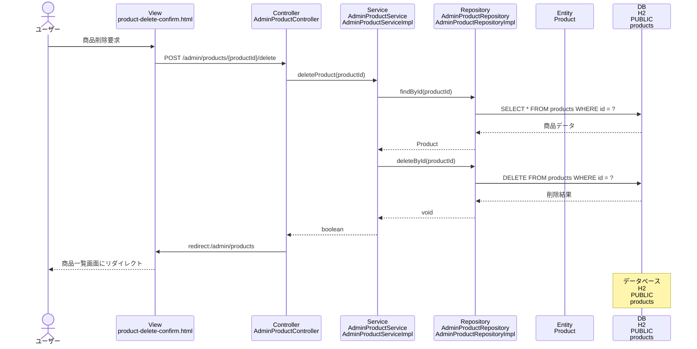

# シーケンス図_商品削除

## シーケンス図

## シーケンス図の解説

### 処理フロー
1. **ユーザーが商品削除を要求**
   - ユーザーが商品削除確認画面で削除を実行

2. **ViewからControllerへのリクエスト**
   - `product-delete-confirm.html`から`AdminProductController`の`productDelete`メソッドにPOSTリクエスト
   - 商品IDをパスパラメータとして受け取る

3. **ControllerからServiceへの処理委譲**
   - `AdminProductController`が`AdminProductService`の`deleteProduct`メソッドを呼び出し
   - 指定された商品IDで削除処理を実行

4. **ServiceからRepositoryへのデータ取得**
   - `AdminProductServiceImpl`が`AdminProductRepository`の`findById`メソッドを呼び出し
   - 削除対象の商品データを取得

5. **データベースアクセス（取得）**
   - `AdminProductRepositoryImpl`がH2データベースのproductsテーブルから商品データを取得

6. **ServiceからRepositoryへの削除処理**
   - `AdminProductServiceImpl`が`AdminProductRepository`の`deleteById`メソッドを呼び出し
   - データベースから商品データを削除

7. **データベースアクセス（削除）**
   - `AdminProductRepositoryImpl`がH2データベースのproductsテーブルからDELETEを実行
   - 指定されたIDの商品データを削除

8. **処理結果の返却**
   - 削除処理の成功/失敗をboolean値で返却

9. **リダイレクト処理**
   - `AdminProductController`が商品一覧画面にリダイレクト
   - 成功/失敗メッセージをFlash属性に設定

10. **画面表示**
    - 商品一覧画面が表示され、削除結果が表示される

### 主要なクラスとメソッド
- **AdminProductController.productDelete()**: 商品削除のエントリーポイント
- **AdminProductService.deleteProduct()**: 商品削除のビジネスロジック
- **AdminProductRepository.deleteById()**: データベースからの商品データ削除
- **AdminProductRepository.findById()**: 削除対象商品の存在確認 