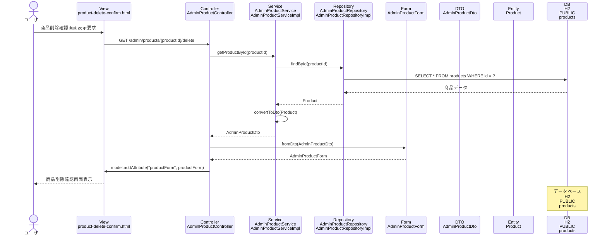

# シーケンス図_商品削除確認

## シーケンス図

## シーケンス図の解説

### 処理フロー
1. **ユーザーが商品削除確認画面表示を要求**
   - ユーザーが特定の商品の削除確認画面にアクセス

2. **ViewからControllerへのリクエスト**
   - `product-delete-confirm.html`から`AdminProductController`の`productDeleteConfirm`メソッドにGETリクエスト
   - 商品IDをパスパラメータとして受け取る

3. **ControllerからServiceへの処理委譲**
   - `AdminProductController`が`AdminProductService`の`getProductById`メソッドを呼び出し
   - 指定された商品IDで商品データを取得

4. **ServiceからRepositoryへのデータ取得**
   - `AdminProductServiceImpl`が`AdminProductRepository`の`findById`メソッドを呼び出し
   - データベースから特定の商品データを取得

5. **データベースアクセス**
   - `AdminProductRepositoryImpl`がH2データベースのproductsテーブルにクエリを実行
   - 指定されたIDの商品データを取得

6. **EntityからDTOへの変換**
   - 取得した`Product`エンティティを`AdminProductDto`に変換

7. **DTOからFormへの変換**
   - `AdminProductController`が`AdminProductForm.fromDto`メソッドを呼び出し
   - DTOからフォームオブジェクトに変換

8. **Viewへのデータ設定**
   - `AdminProductController`がModelに`productForm`を設定

9. **画面表示**
   - `product-delete-confirm.html`テンプレートが商品削除確認フォームを表示

### 主要なクラスとメソッド
- **AdminProductController.productDeleteConfirm()**: 商品削除確認画面表示のエントリーポイント
- **AdminProductService.getProductById()**: 商品詳細取得のビジネスロジック
- **AdminProductRepository.findById()**: データベースからの特定商品データ取得
- **AdminProductForm.fromDto()**: DTOからフォームへの変換メソッド 