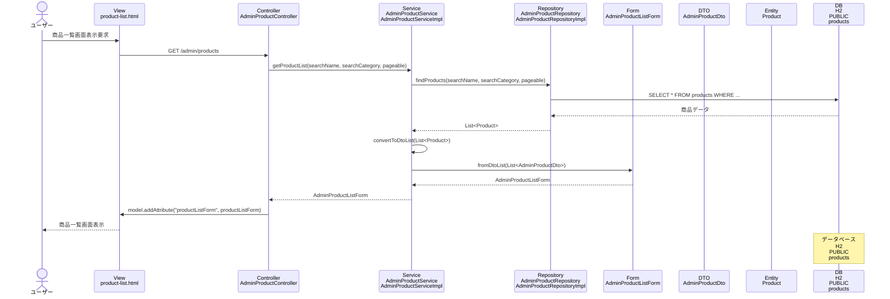

# シーケンス図_商品一覧表示

## シーケンス図

## シーケンス図の解説

### 処理フロー
1. **ユーザーが商品一覧画面表示を要求**
   - ユーザーがブラウザで商品一覧画面にアクセス

2. **ViewからControllerへのリクエスト**
   - `product-list.html`から`AdminProductController`の`productList`メソッドにGETリクエスト

3. **ControllerからServiceへの処理委譲**
   - `AdminProductController`が`AdminProductService`の`getProductList`メソッドを呼び出し
   - 検索条件（商品名、カテゴリ）とページング情報を渡す

4. **ServiceからRepositoryへのデータ取得**
   - `AdminProductServiceImpl`が`AdminProductRepository`の`findProducts`メソッドを呼び出し
   - データベースから商品データを取得

5. **データベースアクセス**
   - `AdminProductRepositoryImpl`がH2データベースのproductsテーブルにクエリを実行
   - 検索条件に基づいて商品データを取得

6. **EntityからDTOへの変換**
   - 取得した`Product`エンティティを`AdminProductDto`に変換
   - `AdminProductListForm`にDTOリストを設定

7. **Viewへのデータ設定**
   - `AdminProductController`がModelに`productListForm`を設定

8. **画面表示**
   - `product-list.html`テンプレートが商品一覧を表示

### 主要なクラスとメソッド
- **AdminProductController.productList()**: 商品一覧表示のエントリーポイント
- **AdminProductService.getProductList()**: 商品一覧取得のビジネスロジック
- **AdminProductRepository.findProducts()**: データベースからの商品データ取得
- **AdminProductListForm**: 商品一覧の表示データを管理するフォームクラス 