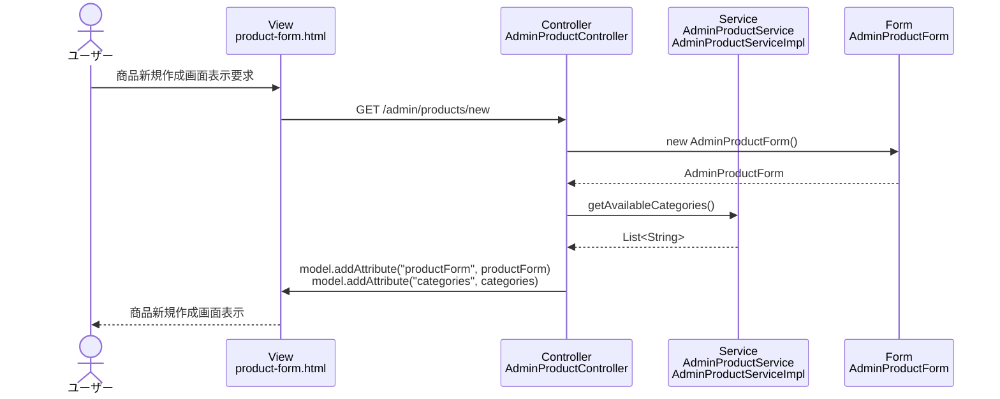

# シーケンス図_商品新規作成

## シーケンス図

## シーケンス図の解説

### 処理フロー
1. **ユーザーが商品新規作成画面表示を要求**
   - ユーザーがブラウザで商品新規作成画面にアクセス

2. **ViewからControllerへのリクエスト**
   - `product-form.html`から`AdminProductController`の`productNew`メソッドにGETリクエスト

3. **フォームオブジェクトの作成**
   - `AdminProductController`が新しい`AdminProductForm`インスタンスを作成
   - 空の商品フォームオブジェクトを初期化

4. **カテゴリ情報の取得**
   - `AdminProductController`が`AdminProductService`の`getAvailableCategories`メソッドを呼び出し
   - 利用可能な商品カテゴリの一覧を取得

5. **Viewへのデータ設定**
   - `AdminProductController`がModelに`productForm`と`categories`を設定

6. **画面表示**
   - `product-form.html`テンプレートが商品新規作成フォームを表示

### 主要なクラスとメソッド
- **AdminProductController.productNew()**: 商品新規作成画面表示のエントリーポイント
- **AdminProductService.getAvailableCategories()**: 利用可能なカテゴリ取得のビジネスロジック
- **AdminProductForm**: 商品の入力データを管理するフォームクラス 