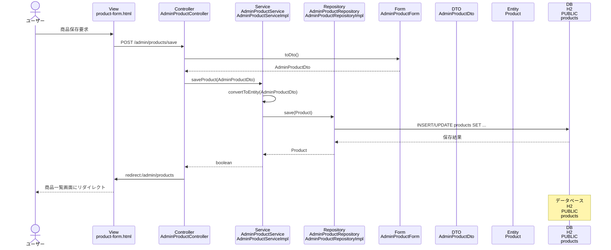

# シーケンス図_商品保存

## シーケンス図

## シーケンス図の解説

### 処理フロー
1. **ユーザーが商品保存を要求**
   - ユーザーが商品フォーム画面で商品情報を入力して送信

2. **ViewからControllerへのリクエスト**
   - `product-form.html`から`AdminProductController`の`productSave`メソッドにPOSTリクエスト
   - 商品情報をフォームデータとして受け取る

3. **FormからDTOへの変換**
   - `AdminProductController`が`AdminProductForm.toDto`メソッドを呼び出し
   - フォームデータをDTOオブジェクトに変換

4. **ControllerからServiceへの処理委譲**
   - `AdminProductController`が`AdminProductService`の`saveProduct`メソッドを呼び出し
   - 商品DTOを渡して保存処理を実行

5. **DTOからEntityへの変換**
   - `AdminProductService`がDTOをEntityに変換
   - 新規作成か更新かを判定して処理を分岐

6. **ServiceからRepositoryへの保存処理**
   - `AdminProductServiceImpl`が`AdminProductRepository`の`save`メソッドを呼び出し
   - データベースに商品データを保存

7. **データベースアクセス**
   - `AdminProductRepositoryImpl`がH2データベースのproductsテーブルにINSERT/UPDATEを実行
   - 商品情報をデータベースに保存

8. **処理結果の返却**
   - 保存処理の成功/失敗をboolean値で返却

9. **リダイレクト処理**
   - `AdminProductController`が商品一覧画面にリダイレクト
   - 成功/失敗メッセージをFlash属性に設定

10. **画面表示**
    - 商品一覧画面が表示され、保存結果が表示される

### 主要なクラスとメソッド
- **AdminProductController.productSave()**: 商品保存のエントリーポイント
- **AdminProductService.saveProduct()**: 商品保存のビジネスロジック
- **AdminProductRepository.save()**: データベースへの商品データ保存
- **AdminProductForm.toDto()**: フォームからDTOへの変換メソッド 