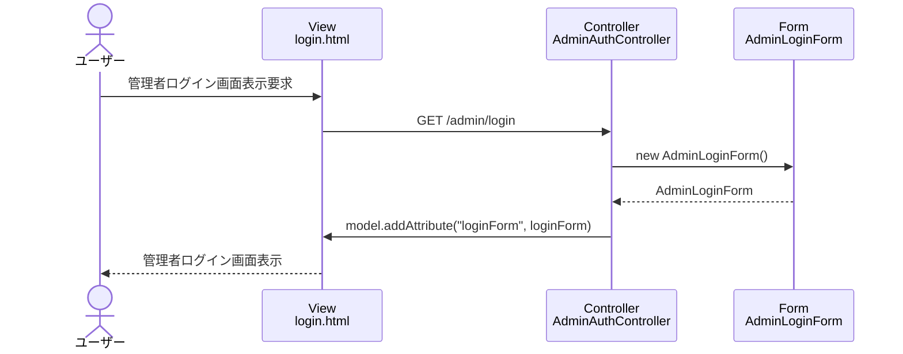

# シーケンス図_管理者ログイン

## シーケンス図

## シーケンス図の解説

### 処理フロー
1. **ユーザーが管理者ログイン画面表示を要求**
   - ユーザーがブラウザで管理者ログイン画面にアクセス

2. **ViewからControllerへのリクエスト**
   - `login.html`から`AdminAuthController`の`showLoginForm`メソッドにGETリクエスト

3. **フォームオブジェクトの作成**
   - `AdminAuthController`が新しい`AdminLoginForm`インスタンスを作成
   - 空のログインフォームオブジェクトを初期化

4. **Viewへのデータ設定**
   - `AdminAuthController`がModelに`loginForm`を設定

5. **画面表示**
   - `login.html`テンプレートが管理者ログインフォームを表示

### 主要なクラスとメソッド
- **AdminAuthController.showLoginForm()**: 管理者ログイン画面表示のエントリーポイント
- **AdminLoginForm**: 管理者ログインの入力データを管理するフォームクラス 