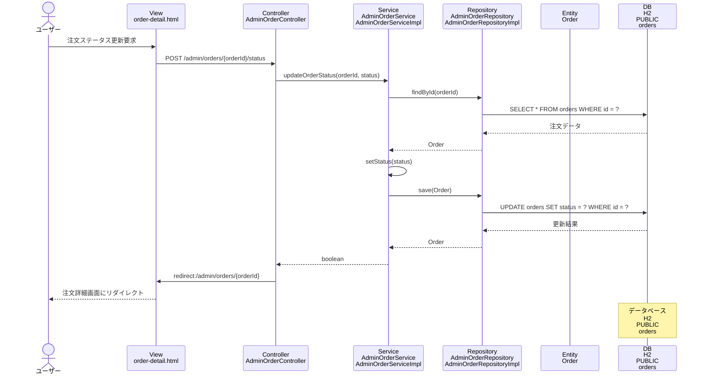

# シーケンス図_注文ステータス更新

## シーケンス図

## シーケンス図の解説

### 処理フロー
1. **ユーザーが注文ステータス更新を要求**
   - ユーザーが注文詳細画面でステータスを変更して送信

2. **ViewからControllerへのリクエスト**
   - `order-detail.html`から`AdminOrderController`の`updateOrderStatus`メソッドにPOSTリクエスト
   - 注文IDと新しいステータスをパラメータとして受け取る

3. **ControllerからServiceへの処理委譲**
   - `AdminOrderController`が`AdminOrderService`の`updateOrderStatus`メソッドを呼び出し
   - 注文IDと新しいステータスを渡す

4. **ServiceからRepositoryへのデータ取得**
   - `AdminOrderServiceImpl`が`AdminOrderRepository`の`findById`メソッドを呼び出し
   - 更新対象の注文データを取得

5. **データベースアクセス（取得）**
   - `AdminOrderRepositoryImpl`がH2データベースのordersテーブルから注文データを取得

6. **ステータス更新処理**
   - `AdminOrderService`が注文エンティティのステータスを更新

7. **データベースアクセス（更新）**
   - `AdminOrderRepositoryImpl`がH2データベースのordersテーブルを更新
   - 新しいステータスで注文データを保存

8. **処理結果の返却**
   - 更新処理の成功/失敗をboolean値で返却

9. **リダイレクト処理**
   - `AdminOrderController`が注文詳細画面にリダイレクト
   - 成功/失敗メッセージをFlash属性に設定

10. **画面表示**
    - 注文詳細画面が再表示され、更新結果が表示される

### 主要なクラスとメソッド
- **AdminOrderController.updateOrderStatus()**: 注文ステータス更新のエントリーポイント
- **AdminOrderService.updateOrderStatus()**: 注文ステータス更新のビジネスロジック
- **AdminOrderRepository.save()**: データベースへの注文データ保存
- **Order.setStatus()**: 注文エンティティのステータス更新 