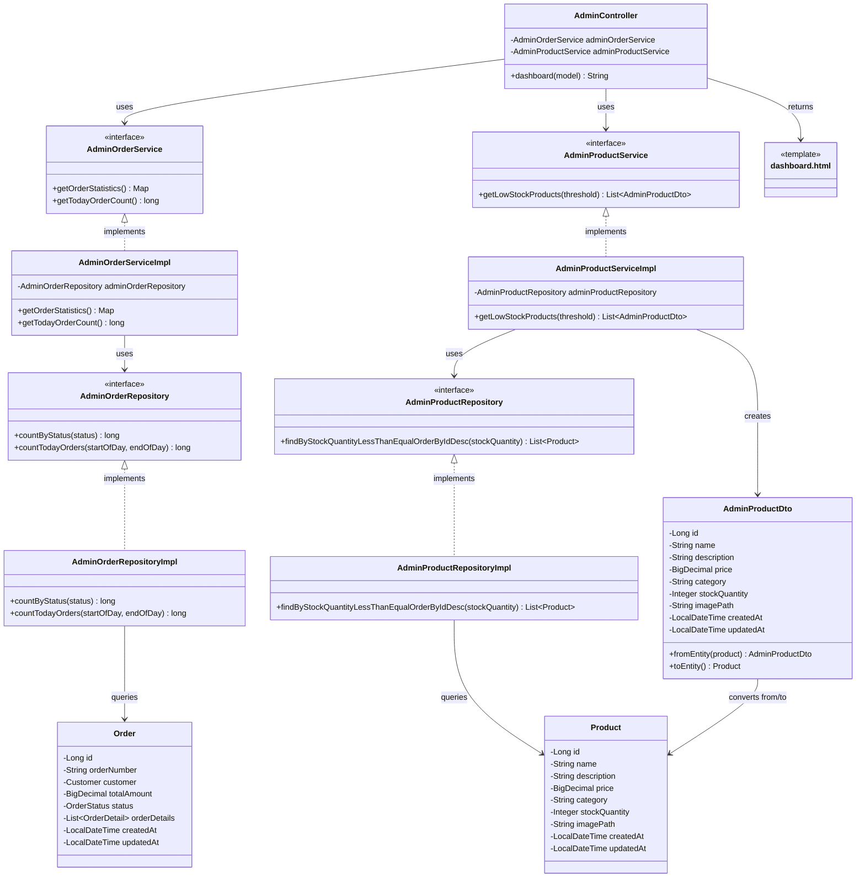

# クラス図_管理者ダッシュボード

## クラス図

## クラス図の解説

### クラス間の関係

1. **AdminController**
   - 管理者ダッシュボードに関するリクエストを処理するコントローラー
   - `AdminOrderService`と`AdminProductService`を依存性注入で使用
   - `dashboard`メソッドで注文統計情報と在庫不足商品を取得してダッシュボードを表示

2. **AdminOrderService / AdminProductService**
   - 管理者向け注文・商品管理サービスのインターフェース
   - 注文統計情報の取得と在庫不足商品の取得機能を定義

3. **AdminOrderServiceImpl / AdminProductServiceImpl**
   - サービスインターフェースの実装クラス
   - 対応するリポジトリを使用してデータアクセスを行う

4. **AdminOrderRepository / AdminProductRepository**
   - 管理者向け注文・商品データアクセス層のインターフェース
   - 注文統計情報と在庫不足商品の取得機能を定義

5. **AdminOrderRepositoryImpl / AdminProductRepositoryImpl**
   - リポジトリインターフェースの実装クラス
   - データベースから注文・商品データを取得する処理を実装

6. **AdminProductDto**
   - 管理者向け商品情報のデータ転送オブジェクト
   - `Product`エンティティとの相互変換機能を提供

7. **Product / Order**
   - 商品・注文情報を管理するエンティティクラス
   - データベースのテーブルに対応

8. **dashboard.html**
   - 管理者ダッシュボード画面のテンプレートファイル
   - 注文統計情報と在庫不足商品一覧を表示

### 処理フロー

1. ユーザーが`/admin`にアクセス
2. `AdminController.dashboard()`が呼び出される
3. `AdminOrderService.getOrderStatistics()`で注文統計情報を取得
4. `AdminProductService.getLowStockProducts()`で在庫不足商品を取得
5. 取得したデータをモデルに追加
6. `dashboard.html`テンプレートが返される
7. ダッシュボード画面が表示される 