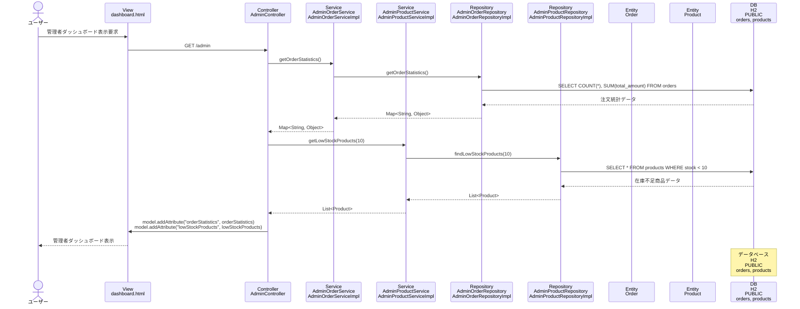

# シーケンス図_管理者ダッシュボード

## シーケンス図

## シーケンス図の解説

### 処理フロー
1. **ユーザーが管理者ダッシュボード表示を要求**
   - ユーザーがブラウザで管理者ダッシュボードにアクセス

2. **ViewからControllerへのリクエスト**
   - `dashboard.html`から`AdminController`の`dashboard`メソッドにGETリクエスト

3. **注文統計情報の取得**
   - `AdminController`が`AdminOrderService`の`getOrderStatistics`メソッドを呼び出し
   - `AdminOrderServiceImpl`が`AdminOrderRepository`の`getOrderStatistics`メソッドを呼び出し
   - データベースから注文統計情報を取得

4. **在庫不足商品の取得**
   - `AdminController`が`AdminProductService`の`getLowStockProducts`メソッドを呼び出し
   - `AdminProductServiceImpl`が`AdminProductRepository`の`findLowStockProducts`メソッドを呼び出し
   - データベースから在庫不足商品を取得

5. **データベースアクセス**
   - `AdminOrderRepositoryImpl`がH2データベースのordersテーブルにクエリを実行
   - `AdminProductRepositoryImpl`がH2データベースのproductsテーブルにクエリを実行

6. **Viewへのデータ設定**
   - `AdminController`がModelに`orderStatistics`と`lowStockProducts`を設定

7. **画面表示**
   - `dashboard.html`テンプレートが管理者ダッシュボードを表示

### 主要なクラスとメソッド
- **AdminController.dashboard()**: 管理者ダッシュボード表示のエントリーポイント
- **AdminOrderService.getOrderStatistics()**: 注文統計情報取得のビジネスロジック
- **AdminProductService.getLowStockProducts()**: 在庫不足商品取得のビジネスロジック
- **AdminOrderRepository.getOrderStatistics()**: データベースからの注文統計情報取得
- **AdminProductRepository.findLowStockProducts()**: データベースからの在庫不足商品取得 