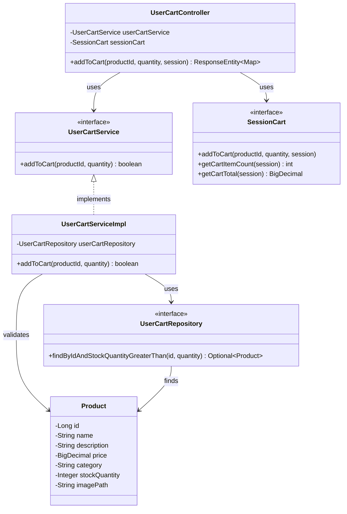

# クラス図

## カート商品追加

## クラス図の解説

### クラス間の関係

1. **UserCartController**
   - `UserCartService`を使用してカート追加の検証を実行
   - `SessionCart`を使用してカートに商品を追加
   - JSONレスポンスを返す

2. **UserCartService**
   - カート商品追加のビジネスロジックを定義するインターフェース
   - `UserCartServiceImpl`が実装を提供

3. **UserCartServiceImpl**
   - `UserCartRepository`を使用して商品の存在確認と在庫チェック
   - バリデーション結果を返す

4. **UserCartRepository**
   - カート関連のデータアクセスを定義するインターフェース
   - 商品の存在確認と在庫チェックメソッドを提供

5. **SessionCart**
   - セッション内のカート情報を管理するインターフェース
   - カートへの商品追加、アイテム数、合計金額の取得メソッドを提供

6. **Product**
   - 商品エンティティクラス
   - データベースの商品テーブルに対応

### 処理フロー

1. ユーザーが商品一覧画面でカート追加ボタンをクリック
2. Ajaxリクエストで`UserCartController.addToCart()`が呼び出される
3. `UserCartService.addToCart()`で商品の存在確認と在庫チェックを実行
4. `UserCartServiceImpl`が`UserCartRepository`から商品情報を取得
5. バリデーションが成功した場合、`SessionCart.addToCart()`でセッションに追加
6. `SessionCart.getCartItemCount()`と`getCartTotal()`でカート情報を取得
7. JSONレスポンスを返す 