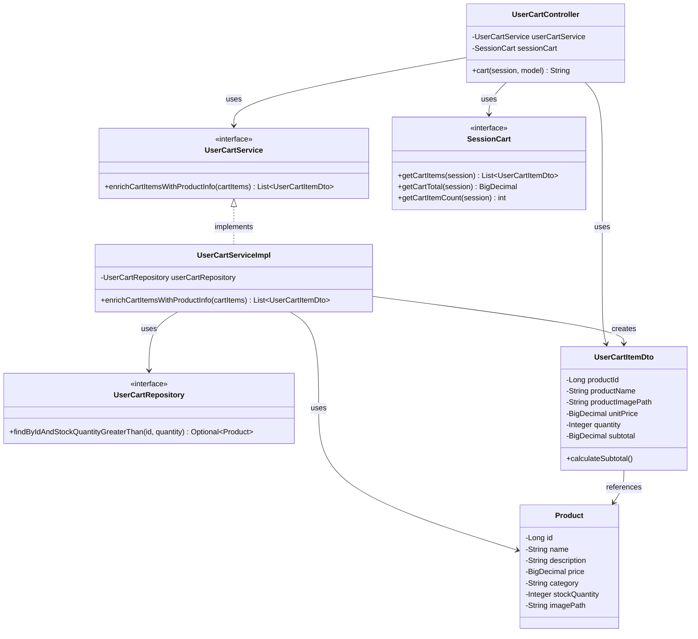

# クラス図

## カート内容表示

## クラス図の解説

### クラス間の関係

1. **UserCartController**
   - `UserCartService`を使用してカートアイテムに商品情報を設定
   - `SessionCart`を使用してカート情報を取得
   - `UserCartItemDto`のリストをビューに渡す

2. **UserCartService**
   - カート情報取得のビジネスロジックを定義するインターフェース
   - `UserCartServiceImpl`が実装を提供

3. **UserCartServiceImpl**
   - `UserCartRepository`を使用して商品情報を取得
   - カートアイテムに商品情報を設定

4. **UserCartRepository**
   - カート関連のデータアクセスを定義するインターフェース
   - 商品の存在確認と在庫チェックメソッドを提供

5. **UserCartItemDto**
   - カートアイテム情報を転送するためのDTOクラス
   - 商品情報と数量、小計を含む

6. **SessionCart**
   - セッション内のカート情報を管理するインターフェース
   - カートアイテムの取得、合計金額、アイテム数の取得メソッドを提供

7. **Product**
   - 商品エンティティクラス
   - データベースの商品テーブルに対応

### 処理フロー

1. ユーザーがカート画面にアクセス
2. `UserCartController.cart()`が呼び出される
3. `SessionCart.getCartItems()`でセッションからカートアイテムを取得
4. `UserCartService.enrichCartItemsWithProductInfo()`でカートアイテムに商品情報を設定
5. `UserCartServiceImpl`が`UserCartRepository`から商品情報を取得
6. `UserCartItemDto`に商品情報を設定
7. `SessionCart.getCartTotal()`と`getCartItemCount()`でカート情報を取得
8. `user/cart.html`テンプレートを返す 