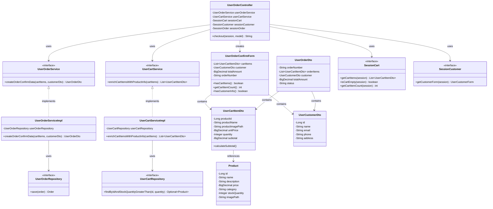

# クラス図

## 注文確認

## クラス図の解説

### クラス間の関係

1. **UserOrderController**
   - `UserOrderService`を使用して注文確認データを作成
   - `UserCartService`を使用してカートアイテムに商品情報を設定
   - `SessionCart`と`SessionCustomer`を使用してセッション情報を取得
   - `UserOrderConfirmForm`を作成してビューに渡す

2. **UserOrderService**
   - 注文確認データ作成のビジネスロジックを定義するインターフェース
   - `UserOrderServiceImpl`が実装を提供

3. **UserOrderServiceImpl**
   - `UserOrderRepository`を使用してデータベース操作を実行
   - 注文確認データを作成

4. **UserCartService**
   - カート情報取得のビジネスロジックを定義するインターフェース
   - `UserCartServiceImpl`が実装を提供

5. **UserCartServiceImpl**
   - `UserCartRepository`を使用して商品情報を取得
   - カートアイテムに商品情報を設定

6. **UserOrderRepository**
   - 注文情報のデータアクセスを定義するインターフェース
   - 注文情報の保存メソッドを提供

7. **UserCartRepository**
   - カート関連のデータアクセスを定義するインターフェース
   - 商品の存在確認と在庫チェックメソッドを提供

8. **UserOrderConfirmForm**
   - 注文確認画面で使用するフォームクラス
   - カートアイテム、顧客情報、合計金額を含む

9. **UserOrderDto**
   - 注文情報を転送するためのDTOクラス
   - 注文アイテム、顧客情報、合計金額を含む

10. **UserCartItemDto**
    - カートアイテム情報を転送するためのDTOクラス
    - 商品情報と数量、小計を含む

11. **UserCustomerDto**
    - 顧客情報を転送するためのDTOクラス
    - 顧客の基本情報を含む

12. **SessionCart**
    - セッション内のカート情報を管理するインターフェース
    - カートアイテムの取得、空チェック、アイテム数の取得メソッドを提供

13. **SessionCustomer**
    - セッション内の顧客情報を管理するインターフェース
    - 顧客フォームの取得メソッドを提供

14. **Product**
    - 商品エンティティクラス
    - データベースの商品テーブルに対応

### 処理フロー

1. ユーザーが注文確認画面にアクセス
2. `UserOrderController.checkout()`が呼び出される
3. `SessionCart.isCartEmpty()`でカートが空でないかチェック
4. `SessionCart.getCartItems()`でセッションからカートアイテムを取得
5. `UserCartService.enrichCartItemsWithProductInfo()`でカートアイテムに商品情報を設定
6. `SessionCustomer.getCustomerForm()`でセッションから顧客情報を取得
7. `UserOrderService.createOrderConfirmData()`で注文確認データを作成
8. `UserOrderConfirmForm`を作成して注文確認データを設定
9. `user/order-confirm.html`テンプレートを返す 