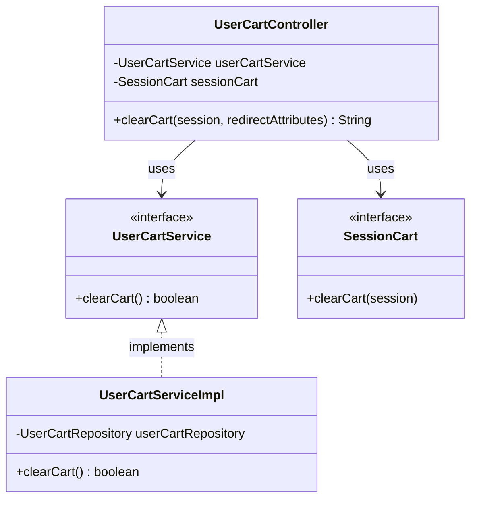

# クラス図

## カートクリア

## クラス図の解説

### クラス間の関係

1. **UserCartController**
   - `UserCartService`を使用してカートクリアの検証を実行
   - `SessionCart`を使用してカートをクリア
   - カート画面にリダイレクト

2. **UserCartService**
   - カートクリアのビジネスロジックを定義するインターフェース
   - `UserCartServiceImpl`が実装を提供

3. **UserCartServiceImpl**
   - カートクリアのバリデーションを実行
   - バリデーション結果を返す

4. **SessionCart**
   - セッション内のカート情報を管理するインターフェース
   - カートをクリアするメソッドを提供

### 処理フロー

1. ユーザーがカート画面でクリアボタンをクリック
2. `UserCartController.clearCart()`が呼び出される
3. `UserCartService.clearCart()`でクリアの検証を実行
4. `UserCartServiceImpl`がバリデーションを実行
5. バリデーションが成功した場合、`SessionCart.clearCart()`でセッションをクリア
6. カート画面にリダイレクト 