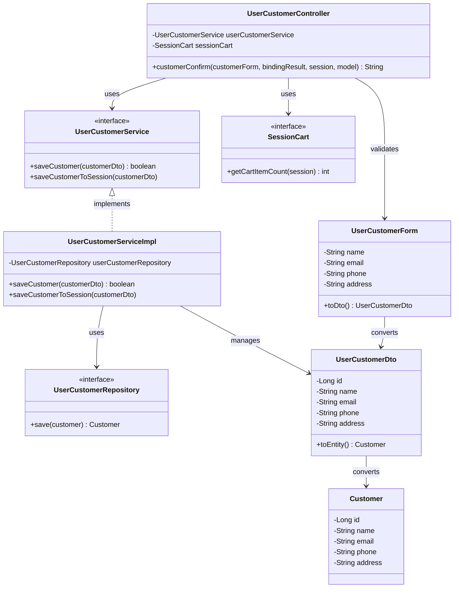

# クラス図

## 顧客情報確認

## クラス図の解説

### クラス間の関係

1. **UserCustomerController**
   - `UserCustomerForm`のバリデーションを実行
   - `UserCustomerService`を使用して顧客情報を保存
   - `SessionCart`を使用してカート情報を確認

2. **UserCustomerService**
   - 顧客情報保存のビジネスロジックを定義するインターフェース
   - `UserCustomerServiceImpl`が実装を提供

3. **UserCustomerServiceImpl**
   - `UserCustomerRepository`を使用してデータベースに保存
   - セッションに顧客情報を保存

4. **UserCustomerRepository**
   - 顧客情報のデータアクセスを定義するインターフェース
   - 顧客情報の保存メソッドを提供

5. **UserCustomerForm**
   - 顧客情報確認画面で使用するフォームクラス
   - バリデーション機能を含む
   - `UserCustomerDto`への変換メソッドを提供

6. **UserCustomerDto**
   - 顧客情報を転送するためのDTOクラス
   - `Customer`エンティティへの変換メソッドを提供

7. **SessionCart**
   - セッション内のカート情報を管理するインターフェース
   - カートアイテム数の取得メソッドを提供

8. **Customer**
   - 顧客エンティティクラス
   - データベースの顧客テーブルに対応

### 処理フロー

1. ユーザーが顧客情報入力画面で確認ボタンをクリック
2. `UserCustomerController.customerConfirm()`が呼び出される
3. `UserCustomerForm`のバリデーションを実行
4. バリデーションエラーがある場合は入力画面に戻る
5. `UserCustomerForm.toDto()`でDTOに変換
6. `UserCustomerService.saveCustomer()`で顧客情報を保存
7. `UserCustomerService.saveCustomerToSession()`でセッションに保存
8. `customer-confirm.html`テンプレートを返す 