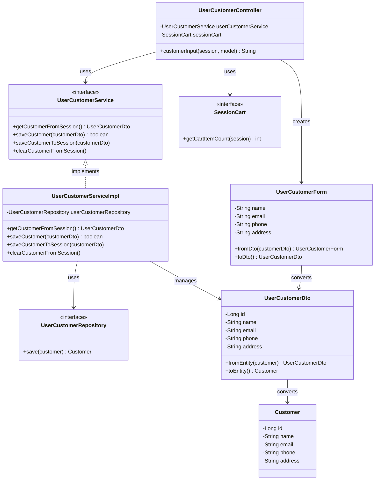

# クラス図

## 顧客情報入力

## クラス図の解説

### クラス間の関係

1. **UserCustomerController**
   - `UserCustomerService`を使用して顧客情報を管理
   - `SessionCart`を使用してカート情報を確認
   - `UserCustomerForm`を作成してビューに渡す

2. **UserCustomerService**
   - 顧客情報管理のビジネスロジックを定義するインターフェース
   - `UserCustomerServiceImpl`が実装を提供

3. **UserCustomerServiceImpl**
   - `UserCustomerRepository`を使用してデータベース操作を実行
   - セッション内の顧客情報を管理

4. **UserCustomerRepository**
   - 顧客情報のデータアクセスを定義するインターフェース
   - 顧客情報の保存メソッドを提供

5. **UserCustomerForm**
   - 顧客情報入力画面で使用するフォームクラス
   - バリデーション機能を含む
   - `UserCustomerDto`との相互変換メソッドを提供

6. **UserCustomerDto**
   - 顧客情報を転送するためのDTOクラス
   - `Customer`エンティティとの相互変換メソッドを提供

7. **SessionCart**
   - セッション内のカート情報を管理するインターフェース
   - カートアイテム数の取得メソッドを提供

8. **Customer**
   - 顧客エンティティクラス
   - データベースの顧客テーブルに対応

### 処理フロー

1. ユーザーが顧客情報入力画面にアクセス
2. `UserCustomerController.customerInput()`が呼び出される
3. `SessionCart.getCartItemCount()`でカートが空でないかチェック
4. `UserCustomerService.getCustomerFromSession()`でセッションから顧客情報を取得
5. 既存の顧客情報がある場合は`UserCustomerForm.fromDto()`で変換
6. ない場合は新しい`UserCustomerForm`を作成
7. `customer-input.html`テンプレートを返す 