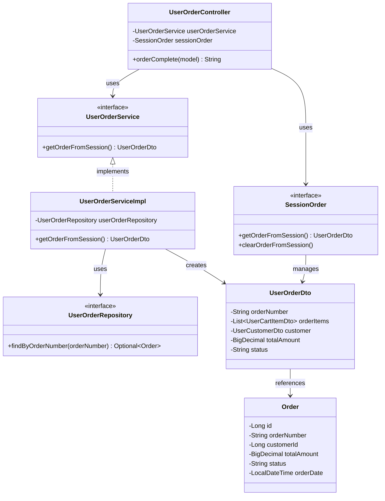

# クラス図

## 注文完了

## クラス図の解説

### クラス間の関係

1. **UserOrderController**
   - `UserOrderService`を使用して注文情報を取得
   - `SessionOrder`を使用してセッションから注文情報を取得
   - 注文完了画面を表示

2. **UserOrderService**
   - 注文完了情報取得のビジネスロジックを定義するインターフェース
   - `UserOrderServiceImpl`が実装を提供

3. **UserOrderServiceImpl**
   - `UserOrderRepository`を使用してデータベースから注文情報を取得
   - セッションから注文情報を取得

4. **UserOrderRepository**
   - 注文情報のデータアクセスを定義するインターフェース
   - 注文番号による注文情報の取得メソッドを提供

5. **UserOrderDto**
   - 注文情報を転送するためのDTOクラス
   - 注文アイテム、顧客情報、合計金額を含む

6. **SessionOrder**
   - セッション内の注文情報を管理するインターフェース
   - 注文情報の取得とクリアメソッドを提供

7. **Order**
   - 注文エンティティクラス
   - データベースの注文テーブルに対応

### 処理フロー

1. ユーザーが注文完了画面にアクセス
2. `UserOrderController.orderComplete()`が呼び出される
3. `SessionOrder.getOrderFromSession()`でセッションから注文情報を取得
4. `UserOrderService.getOrderFromSession()`で注文情報を取得
5. `UserOrderServiceImpl`が注文情報を処理
6. `order-complete.html`テンプレートを返す 