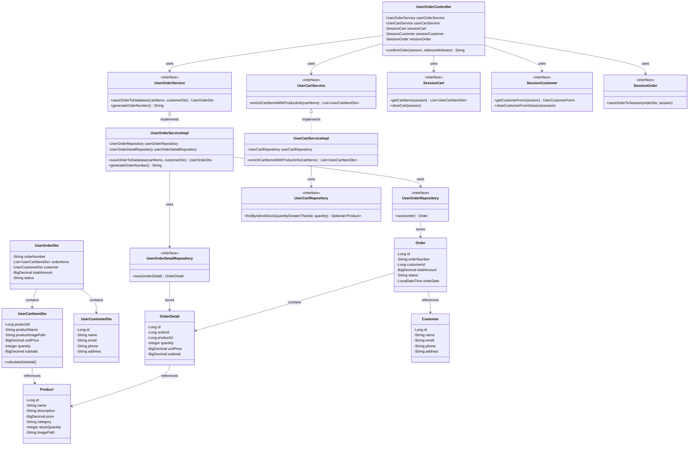

# クラス図

## 注文確定

## クラス図の解説

### クラス間の関係

1. **UserOrderController**
   - `UserOrderService`を使用して注文をデータベースに保存
   - `UserCartService`を使用してカートアイテムに商品情報を設定
   - `SessionCart`、`SessionCustomer`、`SessionOrder`を使用してセッション管理

2. **UserOrderService**
   - 注文確定のビジネスロジックを定義するインターフェース
   - `UserOrderServiceImpl`が実装を提供

3. **UserOrderServiceImpl**
   - `UserOrderRepository`と`UserOrderDetailRepository`を使用してデータベースに保存
   - 注文番号の生成と注文データの作成を実行

4. **UserCartService**
   - カート情報取得のビジネスロジックを定義するインターフェース
   - `UserCartServiceImpl`が実装を提供

5. **UserCartServiceImpl**
   - `UserCartRepository`を使用して商品情報を取得
   - カートアイテムに商品情報を設定

6. **UserOrderRepository**
   - 注文情報のデータアクセスを定義するインターフェース
   - 注文情報の保存メソッドを提供

7. **UserOrderDetailRepository**
   - 注文詳細情報のデータアクセスを定義するインターフェース
   - 注文詳細情報の保存メソッドを提供

8. **UserCartRepository**
   - カート関連のデータアクセスを定義するインターフェース
   - 商品の存在確認と在庫チェックメソッドを提供

9. **UserOrderDto**
   - 注文情報を転送するためのDTOクラス
   - 注文アイテム、顧客情報、合計金額を含む

10. **UserCartItemDto**
    - カートアイテム情報を転送するためのDTOクラス
    - 商品情報と数量、小計を含む

11. **UserCustomerDto**
    - 顧客情報を転送するためのDTOクラス
    - 顧客の基本情報を含む

12. **SessionCart**
    - セッション内のカート情報を管理するインターフェース
    - カートアイテムの取得とクリアメソッドを提供

13. **SessionCustomer**
    - セッション内の顧客情報を管理するインターフェース
    - 顧客フォームの取得とクリアメソッドを提供

14. **SessionOrder**
    - セッション内の注文情報を管理するインターフェース
    - 注文情報の保存メソッドを提供

15. **Order**
    - 注文エンティティクラス
    - データベースの注文テーブルに対応

16. **OrderDetail**
    - 注文詳細エンティティクラス
    - データベースの注文詳細テーブルに対応

17. **Product**
    - 商品エンティティクラス
    - データベースの商品テーブルに対応

18. **Customer**
    - 顧客エンティティクラス
    - データベースの顧客テーブルに対応

### 処理フロー

1. ユーザーが注文確認画面で確定ボタンをクリック
2. `UserOrderController.confirmOrder()`が呼び出される
3. `SessionCart.getCartItems()`でセッションからカートアイテムを取得
4. `UserCartService.enrichCartItemsWithProductInfo()`でカートアイテムに商品情報を設定
5. `SessionCustomer.getCustomerForm()`でセッションから顧客情報を取得
6. `UserOrderService.saveOrderToDatabase()`で注文をデータベースに保存
7. `UserOrderService.generateOrderNumber()`で注文番号を生成
8. `SessionOrder.saveOrderToSession()`でセッションに注文情報を保存
9. `SessionCart.clearCart()`と`SessionCustomer.clearCustomerFromSession()`でセッションをクリア
10. 注文完了画面にリダイレクト 