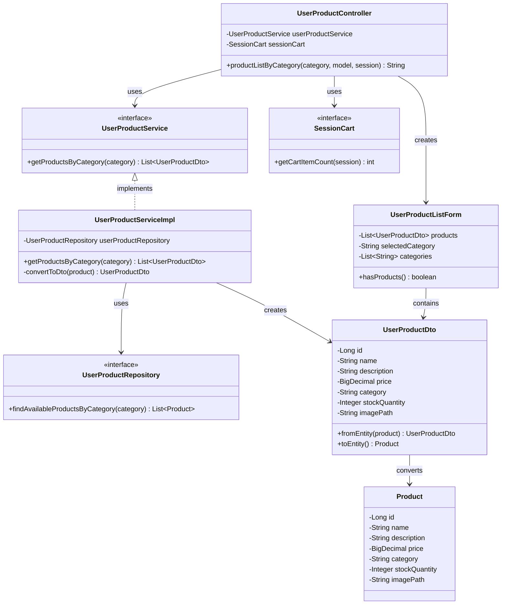

# クラス図

## カテゴリ別商品表示

## クラス図の解説

### クラス間の関係

1. **UserProductController**
   - `UserProductService`を使用してカテゴリ別商品情報を取得
   - `SessionCart`を使用してカート情報を取得
   - `UserProductListForm`を作成してビューに渡す

2. **UserProductService**
   - カテゴリ別商品情報取得のビジネスロジックを定義するインターフェース
   - `UserProductServiceImpl`が実装を提供

3. **UserProductServiceImpl**
   - `UserProductRepository`を使用してデータベースからカテゴリ別商品情報を取得
   - `Product`エンティティを`UserProductDto`に変換

4. **UserProductRepository**
   - カテゴリ別商品情報のデータアクセスを定義するインターフェース
   - 指定カテゴリの利用可能な商品の取得メソッドを提供

5. **UserProductListForm**
   - カテゴリ別商品一覧画面で使用するフォームクラス
   - `UserProductDto`のリストと選択されたカテゴリを保持

6. **UserProductDto**
   - 商品情報を転送するためのDTOクラス
   - `Product`エンティティとの相互変換メソッドを提供

7. **SessionCart**
   - セッション内のカート情報を管理するインターフェース
   - カートアイテム数の取得メソッドを提供

8. **Product**
   - 商品エンティティクラス
   - データベースの商品テーブルに対応

### 処理フロー

1. ユーザーがカテゴリ別商品一覧画面にアクセス
2. `UserProductController.productListByCategory()`が呼び出される
3. `UserProductService.getProductsByCategory()`で指定カテゴリの商品情報を取得
4. `UserProductServiceImpl`が`UserProductRepository`からデータを取得
5. `Product`エンティティを`UserProductDto`に変換
6. `UserProductListForm`を作成して商品リストと選択カテゴリを設定
7. `SessionCart.getCartItemCount()`でカート情報を取得
8. `product-list.html`テンプレートを返す 