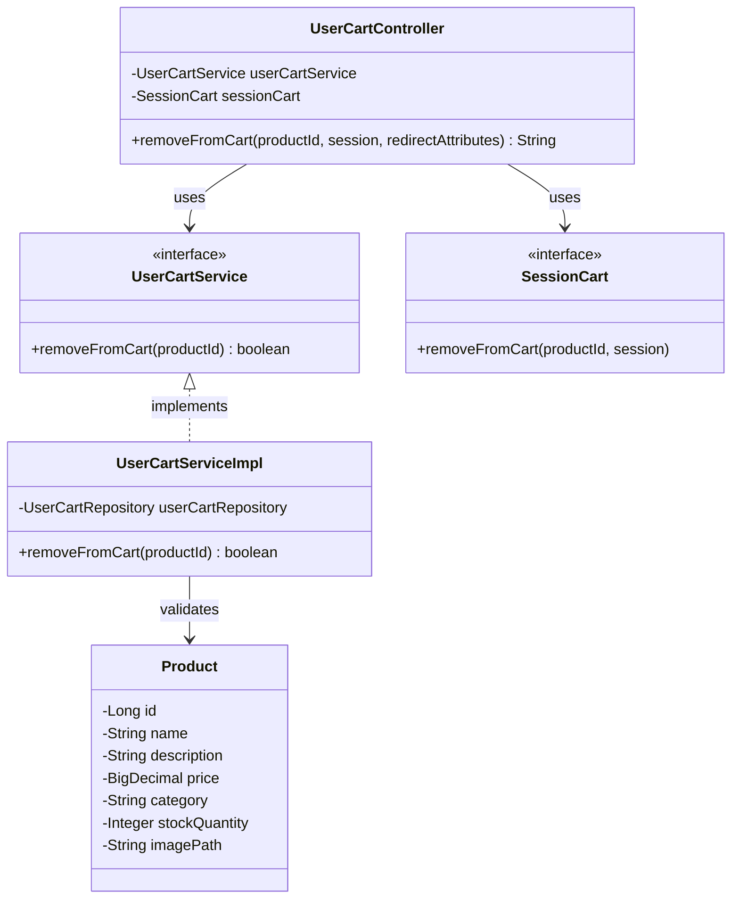

# クラス図

## カート商品削除

## クラス図の解説

### クラス間の関係

1. **UserCartController**
   - `UserCartService`を使用してカート削除の検証を実行
   - `SessionCart`を使用してカートから商品を削除
   - カート画面にリダイレクト

2. **UserCartService**
   - カート商品削除のビジネスロジックを定義するインターフェース
   - `UserCartServiceImpl`が実装を提供

3. **UserCartServiceImpl**
   - カート商品削除のバリデーションを実行
   - バリデーション結果を返す

4. **SessionCart**
   - セッション内のカート情報を管理するインターフェース
   - カートから商品を削除するメソッドを提供

5. **Product**
   - 商品エンティティクラス
   - データベースの商品テーブルに対応

### 処理フロー

1. ユーザーがカート画面で削除ボタンをクリック
2. `UserCartController.removeFromCart()`が呼び出される
3. `UserCartService.removeFromCart()`で削除の検証を実行
4. `UserCartServiceImpl`がバリデーションを実行
5. バリデーションが成功した場合、`SessionCart.removeFromCart()`でセッションから削除
6. カート画面にリダイレクト 