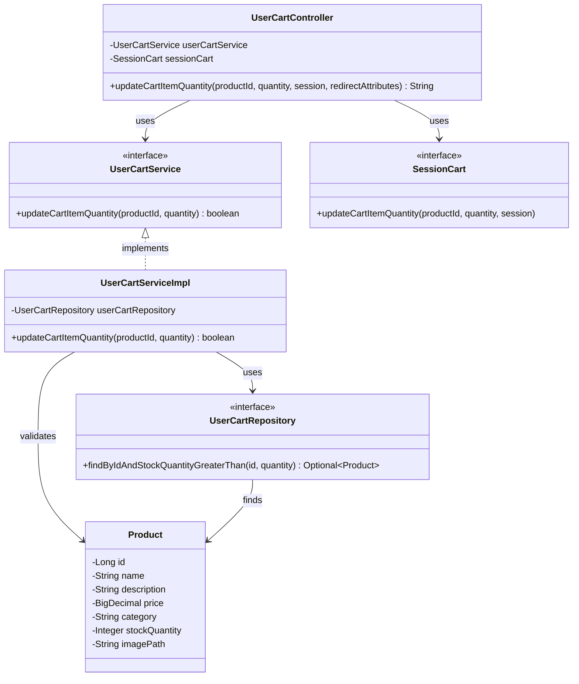

# クラス図

## カート商品数量更新

## クラス図の解説

### クラス間の関係

1. **UserCartController**
   - `UserCartService`を使用してカート数量更新の検証を実行
   - `SessionCart`を使用してカート内の商品数量を更新
   - カート画面にリダイレクト

2. **UserCartService**
   - カート商品数量更新のビジネスロジックを定義するインターフェース
   - `UserCartServiceImpl`が実装を提供

3. **UserCartServiceImpl**
   - `UserCartRepository`を使用して商品の存在確認と在庫チェック
   - 数量更新のバリデーションを実行

4. **UserCartRepository**
   - カート関連のデータアクセスを定義するインターフェース
   - 商品の存在確認と在庫チェックメソッドを提供

5. **SessionCart**
   - セッション内のカート情報を管理するインターフェース
   - カート内の商品数量を更新するメソッドを提供

6. **Product**
   - 商品エンティティクラス
   - データベースの商品テーブルに対応

### 処理フロー

1. ユーザーがカート画面で数量を変更して更新ボタンをクリック
2. `UserCartController.updateCartItemQuantity()`が呼び出される
3. `UserCartService.updateCartItemQuantity()`で数量更新の検証を実行
4. `UserCartServiceImpl`が`UserCartRepository`から商品情報を取得
5. 在庫チェックとバリデーションを実行
6. バリデーションが成功した場合、`SessionCart.updateCartItemQuantity()`でセッションを更新
7. カート画面にリダイレクト 