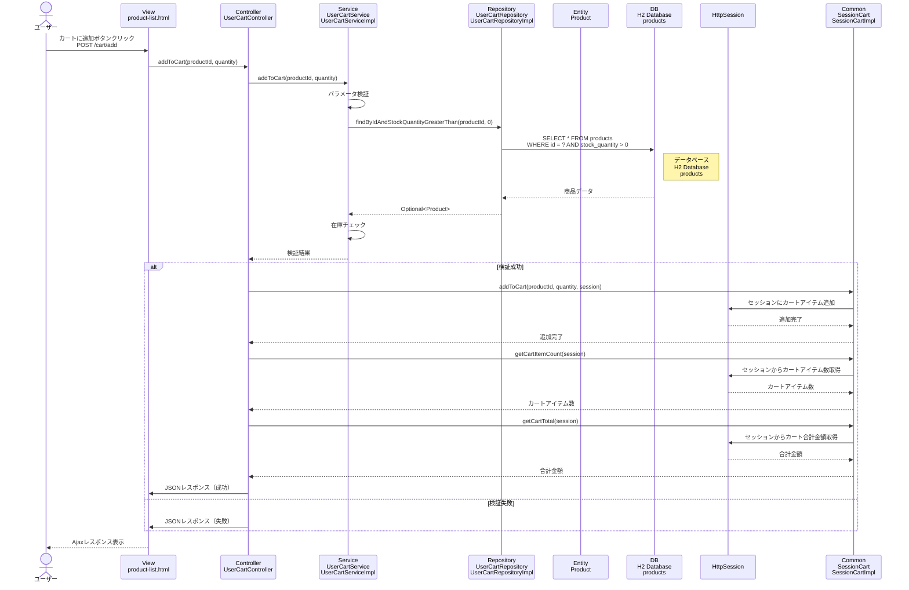

# シーケンス図_カート商品追加

## 概要
カート商品追加機能のシーケンス図です。Ajaxでカートに商品を追加する際の処理フローを示します。

## シーケンス図

## 解説

### 処理フロー
1. **ユーザーアクション**: ユーザーが商品一覧画面で「カートに追加」ボタンをクリック
2. **Ajaxリクエスト**: 商品IDと数量をPOSTで送信（`/cart/add`）
3. **コントローラー処理**: `UserCartController.addToCart()`メソッドが実行される
4. **サービス層呼び出し**: `UserCartService.addToCart()`でビジネスロジックを実行
5. **パラメータ検証**: 商品IDと数量の妥当性をチェック
6. **商品情報取得**: `UserCartRepository.findByIdAndStockQuantityGreaterThan()`で商品情報を取得
7. **データベースアクセス**: H2データベースのproductsテーブルから在庫のある商品を取得
8. **在庫チェック**: 要求数量が在庫数以下かチェック
9. **セッション更新**: 検証成功時、`SessionCart.addToCart()`でセッションにカートアイテムを追加
10. **カート情報取得**: 更新後のカートアイテム数と合計金額を取得
11. **JSONレスポンス**: 処理結果をJSON形式で返却
12. **画面更新**: Ajaxで画面のカート情報を更新

### 主要なクラスと役割
- **UserCartController**: Ajaxリクエストを受け取り、サービスとセッションを連携
- **UserCartService**: ビジネスロジック（パラメータ検証、在庫チェック）を実行
- **UserCartRepository**: 商品情報のデータベースアクセスを担当
- **SessionCart**: セッション内のカート情報を管理
- **HttpSession**: カート情報の永続化

### 特徴
- Ajaxによる非同期処理
- リアルタイムでの在庫状況確認
- セッション管理によるカート情報の永続化
- JSON形式でのレスポンス
- エラーハンドリングによる適切なフィードバック 