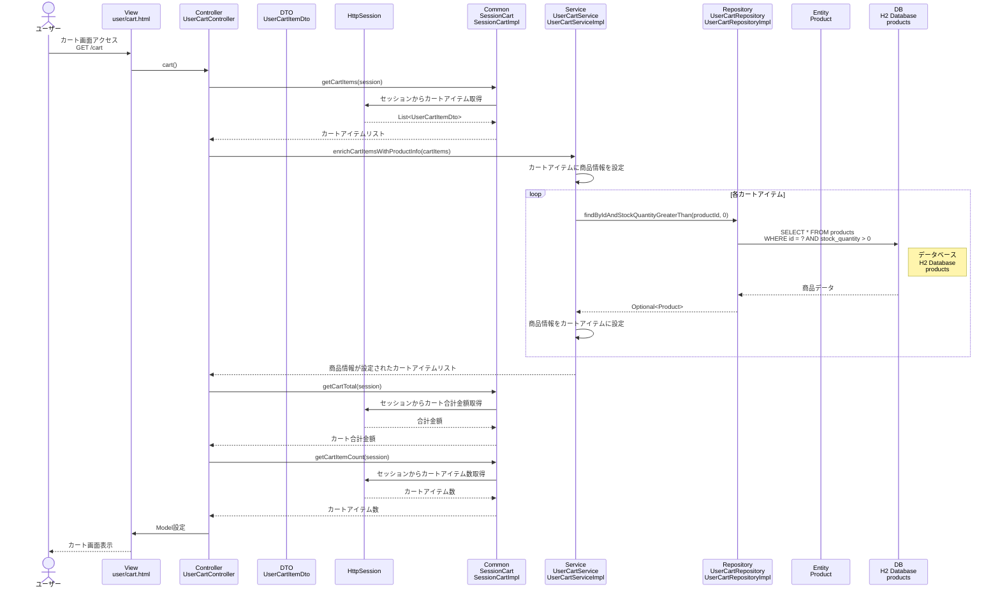

# シーケンス図_カート内容表示

## 概要
カート内容表示機能のシーケンス図です。ユーザーがカート画面にアクセスした際の処理フローを示します。

## シーケンス図

## 解説

### 処理フロー
1. **ユーザーアクセス**: ユーザーがカート画面（`/cart`）にアクセス
2. **コントローラー処理**: `UserCartController.cart()`メソッドが実行される
3. **セッションからカート情報取得**: `SessionCart.getCartItems()`でセッションからカートアイテムを取得
4. **商品情報設定**: `UserCartService.enrichCartItemsWithProductInfo()`でカートアイテムに商品詳細情報を設定
5. **商品情報取得**: 各カートアイテムの商品IDを使用して、データベースから商品情報を取得
6. **データベースアクセス**: H2データベースのproductsテーブルから在庫のある商品情報を取得
7. **カート合計金額取得**: `SessionCart.getCartTotal()`でセッションからカート合計金額を取得
8. **カートアイテム数取得**: `SessionCart.getCartItemCount()`でセッションからカートアイテム数を取得
9. **画面表示**: カート画面を表示

### 主要なクラスと役割
- **UserCartController**: リクエストを受け取り、セッションとサービスを連携
- **SessionCart**: セッション内のカート情報を管理（アイテム、合計金額、アイテム数）
- **UserCartService**: カートアイテムに商品詳細情報を設定するビジネスロジック
- **UserCartRepository**: 商品情報のデータベースアクセスを担当
- **UserCartItemDto**: カートアイテムの情報を保持（商品ID、数量、小計など）

### 特徴
- セッション管理によるカート情報の永続化
- カートアイテムと商品詳細情報の分離管理
- リアルタイムでの在庫状況確認
- 合計金額とアイテム数の動的計算 