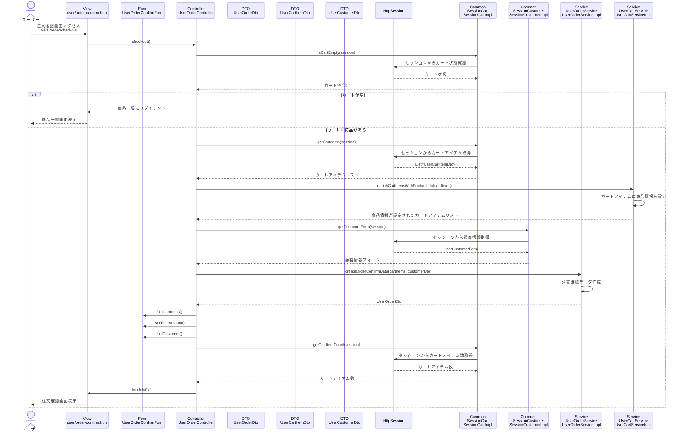

# シーケンス図_注文確認

## 概要
注文確認機能のシーケンス図です。注文内容を確認する際の処理フローを示します。

## シーケンス図

## 解説

### 処理フロー
1. **ユーザーアクセス**: ユーザーが注文確認画面（`/order/checkout`）にアクセス
2. **コントローラー処理**: `UserOrderController.checkout()`メソッドが実行される
3. **カート確認**: `SessionCart.isCartEmpty()`でカートが空かチェック
4. **カート空判定**: カートが空の場合は商品一覧にリダイレクト
5. **カートアイテム取得**: `SessionCart.getCartItems()`でセッションからカートアイテムを取得
6. **商品情報設定**: `UserCartService.enrichCartItemsWithProductInfo()`でカートアイテムに商品詳細情報を設定
7. **顧客情報取得**: `SessionCustomer.getCustomerForm()`でセッションから顧客情報を取得
8. **注文確認データ作成**: `UserOrderService.createOrderConfirmData()`で注文確認用のデータを作成
9. **フォーム設定**: `UserOrderConfirmForm`にカートアイテム、合計金額、顧客情報を設定
10. **カート情報取得**: `SessionCart.getCartItemCount()`でカートアイテム数を取得
11. **画面表示**: 注文確認画面を表示

### 主要なクラスと役割
- **UserOrderController**: リクエストを受け取り、注文確認処理を統括
- **UserOrderService**: 注文確認データの作成を担当
- **UserCartService**: カートアイテムに商品情報を設定
- **SessionCart**: セッション内のカート情報を管理
- **SessionCustomer**: セッション内の顧客情報を管理
- **UserOrderConfirmForm**: 注文確認用のフォームデータを保持
- **UserOrderDto**: 注文情報のデータ転送オブジェクト
- **HttpSession**: カート情報と顧客情報の永続化

### 特徴
- カートの状態に応じた画面遷移制御
- セッション管理によるカート情報と顧客情報の統合
- 商品情報の動的取得と設定
- 注文確認データの統合作成
- 適切なエラーハンドリング 