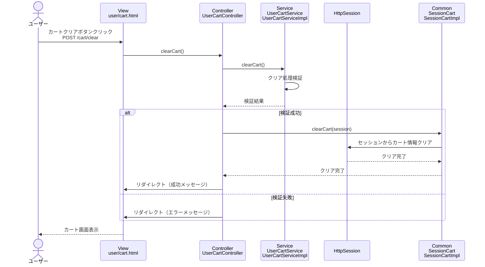

# シーケンス図_カートクリア

## 概要
カートクリア機能のシーケンス図です。カート内の全商品を削除する際の処理フローを示します。

## シーケンス図

## 解説

### 処理フロー
1. **ユーザーアクション**: ユーザーがカート画面で「カートクリア」ボタンをクリック
2. **POSTリクエスト**: クリア処理をPOSTで送信（`/cart/clear`）
3. **コントローラー処理**: `UserCartController.clearCart()`メソッドが実行される
4. **サービス層呼び出し**: `UserCartService.clearCart()`でビジネスロジックを実行
5. **クリア処理検証**: カートクリア処理の妥当性をチェック
6. **セッションクリア**: 検証成功時、`SessionCart.clearCart()`でセッションからカート情報をクリア
7. **リダイレクト**: 処理結果に応じてカート画面にリダイレクト
8. **画面表示**: 成功/エラーメッセージと共にカート画面を表示

### 主要なクラスと役割
- **UserCartController**: リクエストを受け取り、サービスとセッションを連携
- **UserCartService**: ビジネスロジック（クリア処理検証）を実行
- **SessionCart**: セッション内のカート情報を管理
- **HttpSession**: カート情報の永続化

### 特徴
- シンプルなクリア処理
- セッション管理によるカート情報の完全削除
- リダイレクトによる画面遷移
- フラッシュメッセージによる処理結果の通知
- エラーハンドリングによる適切なフィードバック 