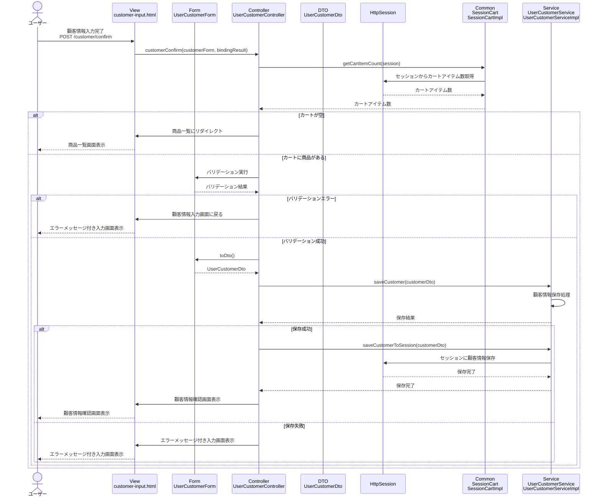

# シーケンス図_顧客情報確認

## 概要
顧客情報確認機能のシーケンス図です。入力された顧客情報を確認する際の処理フローを示します。

## シーケンス図

## 解説

### 処理フロー
1. **ユーザーアクション**: ユーザーが顧客情報入力画面で「確認」ボタンをクリック
2. **POSTリクエスト**: 顧客情報をPOSTで送信（`/customer/confirm`）
3. **コントローラー処理**: `UserCustomerController.customerConfirm()`メソッドが実行される
4. **カート確認**: `SessionCart.getCartItemCount()`でカートに商品があるかチェック
5. **カート空判定**: カートが空の場合は商品一覧にリダイレクト
6. **バリデーション**: 入力された顧客情報の妥当性をチェック
7. **バリデーションエラー処理**: エラーがある場合は入力画面に戻る
8. **DTO変換**: `UserCustomerForm.toDto()`でフォームをDTOに変換
9. **顧客情報保存**: `UserCustomerService.saveCustomer()`で顧客情報を保存
10. **セッション保存**: 保存成功時、`UserCustomerService.saveCustomerToSession()`でセッションに顧客情報を保存
11. **画面遷移**: 成功時は確認画面、失敗時はエラーメッセージ付き入力画面を表示

### 主要なクラスと役割
- **UserCustomerController**: リクエストを受け取り、バリデーションとサービスを連携
- **UserCustomerService**: 顧客情報の保存とセッション管理を担当
- **SessionCart**: セッション内のカート情報を管理
- **UserCustomerForm**: 顧客情報入力用のフォームデータを保持（バリデーション機能付き）
- **UserCustomerDto**: 顧客情報のデータ転送オブジェクト
- **HttpSession**: 顧客情報の永続化

### 特徴
- カートの状態に応じた画面遷移制御
- フォームバリデーションによる入力値チェック
- セッション管理による顧客情報の永続化
- エラーハンドリングによる適切なフィードバック
- 確認画面への遷移制御 