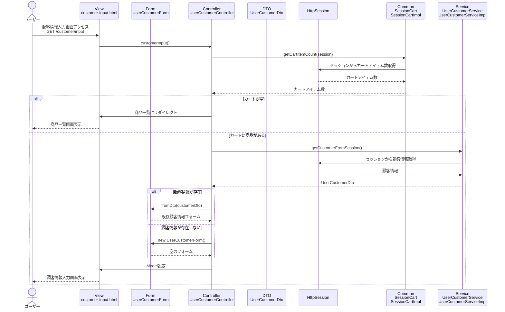

# シーケンス図_顧客情報入力

## 概要
顧客情報入力機能のシーケンス図です。顧客情報を入力する際の処理フローを示します。

## シーケンス図

## 解説

### 処理フロー
1. **ユーザーアクセス**: ユーザーが顧客情報入力画面（`/customer/input`）にアクセス
2. **コントローラー処理**: `UserCustomerController.customerInput()`メソッドが実行される
3. **カート確認**: `SessionCart.getCartItemCount()`でカートに商品があるかチェック
4. **カート空判定**: カートが空の場合は商品一覧にリダイレクト
5. **顧客情報取得**: `UserCustomerService.getCustomerFromSession()`でセッションから既存の顧客情報を取得
6. **フォーム作成**: 既存の顧客情報がある場合は`UserCustomerForm.fromDto()`でフォームを作成、ない場合は空のフォームを作成
7. **画面表示**: 顧客情報入力画面を表示

### 主要なクラスと役割
- **UserCustomerController**: リクエストを受け取り、サービスとセッションを連携
- **UserCustomerService**: 顧客情報の取得と管理を担当
- **SessionCart**: セッション内のカート情報を管理
- **UserCustomerForm**: 顧客情報入力用のフォームデータを保持
- **UserCustomerDto**: 顧客情報のデータ転送オブジェクト
- **HttpSession**: 顧客情報の永続化

### 特徴
- カートの状態に応じた画面遷移制御
- セッション管理による顧客情報の永続化
- 既存顧客情報の再利用
- バリデーション機能付きフォーム
- 適切なエラーハンドリング 