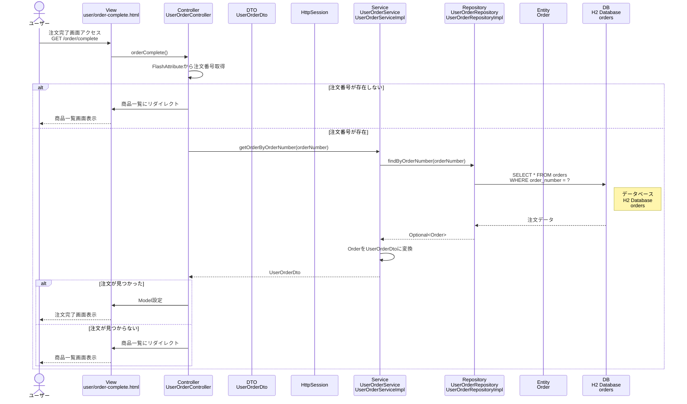

# シーケンス図_注文完了

## 概要
注文完了機能のシーケンス図です。注文完了画面を表示する際の処理フローを示します。

## シーケンス図

## 解説

### 処理フロー
1. **ユーザーアクセス**: ユーザーが注文完了画面（`/order/complete`）にアクセス
2. **コントローラー処理**: `UserOrderController.orderComplete()`メソッドが実行される
3. **注文番号取得**: FlashAttributeから注文番号を取得
4. **注文番号確認**: 注文番号が存在しない場合は商品一覧にリダイレクト
5. **注文検索**: `UserOrderService.getOrderByOrderNumber()`で注文番号から注文情報を取得
6. **リポジトリ呼び出し**: `UserOrderRepository.findByOrderNumber()`でデータベースから注文を検索
7. **データベースアクセス**: H2データベースのordersテーブルから注文番号で注文を取得
8. **DTO変換**: OrderエンティティをUserOrderDtoに変換
9. **注文存在確認**: 注文が見つかった場合は注文完了画面を表示、見つからない場合は商品一覧にリダイレクト
10. **画面表示**: 注文完了画面を表示

### 主要なクラスと役割
- **UserOrderController**: リクエストを受け取り、注文完了処理を統括
- **UserOrderService**: 注文情報の取得とDTO変換を担当
- **UserOrderRepository**: 注文情報のデータベースアクセスを担当
- **UserOrderDto**: 注文情報のデータ転送オブジェクト
- **Order**: 注文エンティティ
- **HttpSession**: FlashAttributeによる注文番号の永続化

### 特徴
- FlashAttributeによる注文番号の一時的な保持
- 注文番号による注文情報の検索
- 適切なエラーハンドリング（注文番号なし、注文未発見）
- セキュリティ考慮（直接アクセス防止）
- データベースからの注文情報取得 